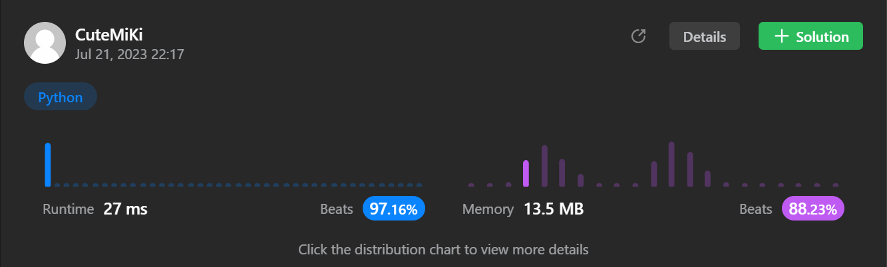

# 3. Longest Substring Without Repeating Characters
### Tag: [Medium](https://github.com/TheOnlyMiki/LeetCode-For-Fun/tree/main#medium-level), [Hash Table](https://github.com/TheOnlyMiki/LeetCode-For-Fun/tree/main#hash-table), [String](https://github.com/TheOnlyMiki/LeetCode-For-Fun/tree/main#string), [Sliding Window](https://github.com/TheOnlyMiki/LeetCode-For-Fun/tree/main#sliding-window)
---
<div class="px-5 pt-4"><div class="flex"></div><div class="_1l1MA" data-track-load="description_content"><p>Given a string <code>s</code>, find the length of the <strong>longest</strong> <span data-keyword="substring-nonempty" class=" cursor-pointer relative text-dark-blue-s text-sm"><div class="popover-wrapper inline-block" data-headlessui-state=""><div><div id="headlessui-popover-button-:ru:" aria-expanded="false" data-headlessui-state=""><strong>substring</strong></div></div></div></span> without repeating characters.</p>

<p>&nbsp;</p>
<p><strong class="example">Example 1:</strong></p>

<pre><strong>Input:</strong> s = "abcabcbb"
<strong>Output:</strong> 3
<strong>Explanation:</strong> The answer is "abc", with the length of 3.
</pre>

<p><strong class="example">Example 2:</strong></p>

<pre><strong>Input:</strong> s = "bbbbb"
<strong>Output:</strong> 1
<strong>Explanation:</strong> The answer is "b", with the length of 1.
</pre>

<p><strong class="example">Example 3:</strong></p>

<pre><strong>Input:</strong> s = "pwwkew"
<strong>Output:</strong> 3
<strong>Explanation:</strong> The answer is "wke", with the length of 3.
Notice that the answer must be a substring, "pwke" is a subsequence and not a substring.
</pre>

<p>&nbsp;</p>
<p><strong>Constraints:</strong></p>

<ul>
	<li><code>0 &lt;= s.length &lt;= 5 * 10<sup>4</sup></code></li>
	<li><code>s</code> consists of English letters, digits, symbols and spaces.</li>
</ul>
</div></div>

---


### Solution

```python
class Solution(object):
    def lengthOfLongestSubstring(self, s):
        """
        :type s: str
        :rtype: int
        """

        if len(s) == 0:
            return 0

        output = 1
        i = 1
        record = s[0]

        for c in s:
            if c in record:
                record = record[record.index(c) + 1:] + c
            else:
                record += c
                output = max(output, len(record))

        return output
```
