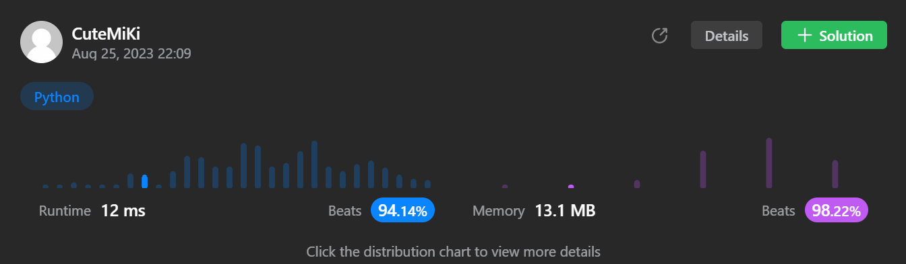

# 8. String to Integer (atoi)
### Tag: [Medium](https://github.com/TheOnlyMiki/LeetCode-For-Fun/tree/main#medium-level), [String](https://github.com/TheOnlyMiki/LeetCode-For-Fun/tree/main#string)
---
<div class="px-5 pt-4"><div class="flex"></div><div class="xFUwe" data-track-load="description_content"><p>Implement the <code>myAtoi(string s)</code> function, which converts a string to a 32-bit signed integer (similar to C/C++'s <code>atoi</code> function).</p>

<p>The algorithm for <code>myAtoi(string s)</code> is as follows:</p>

<ol>
	<li>Read in and ignore any leading whitespace.</li>
	<li>Check if the next character (if not already at the end of the string) is <code>'-'</code> or <code>'+'</code>. Read this character in if it is either. This determines if the final result is negative or positive respectively. Assume the result is positive if neither is present.</li>
	<li>Read in next the characters until the next non-digit character or the end of the input is reached. The rest of the string is ignored.</li>
	<li>Convert these digits into an integer (i.e. <code>"123" -&gt; 123</code>, <code>"0032" -&gt; 32</code>). If no digits were read, then the integer is <code>0</code>. Change the sign as necessary (from step 2).</li>
	<li>If the integer is out of the 32-bit signed integer range <code>[-2<sup>31</sup>, 2<sup>31</sup> - 1]</code>, then clamp the integer so that it remains in the range. Specifically, integers less than <code>-2<sup>31</sup></code> should be clamped to <code>-2<sup>31</sup></code>, and integers greater than <code>2<sup>31</sup> - 1</code> should be clamped to <code>2<sup>31</sup> - 1</code>.</li>
	<li>Return the integer as the final result.</li>
</ol>

<p><strong>Note:</strong></p>

<ul>
	<li>Only the space character <code>' '</code> is considered a whitespace character.</li>
	<li><strong>Do not ignore</strong> any characters other than the leading whitespace or the rest of the string after the digits.</li>
</ul>

<p>&nbsp;</p>
<p><strong class="example">Example 1:</strong></p>

<pre><strong>Input:</strong> s = "42"
<strong>Output:</strong> 42
<strong>Explanation:</strong> The underlined characters are what is read in, the caret is the current reader position.
Step 1: "42" (no characters read because there is no leading whitespace)
         ^
Step 2: "42" (no characters read because there is neither a '-' nor '+')
         ^
Step 3: "<u>42</u>" ("42" is read in)
           ^
The parsed integer is 42.
Since 42 is in the range [-2<sup>31</sup>, 2<sup>31</sup> - 1], the final result is 42.
</pre>

<p><strong class="example">Example 2:</strong></p>

<pre><strong>Input:</strong> s = "   -42"
<strong>Output:</strong> -42
<strong>Explanation:</strong>
Step 1: "<u>   </u>-42" (leading whitespace is read and ignored)
            ^
Step 2: "   <u>-</u>42" ('-' is read, so the result should be negative)
             ^
Step 3: "   -<u>42</u>" ("42" is read in)
               ^
The parsed integer is -42.
Since -42 is in the range [-2<sup>31</sup>, 2<sup>31</sup> - 1], the final result is -42.
</pre>

<p><strong class="example">Example 3:</strong></p>

<pre><strong>Input:</strong> s = "4193 with words"
<strong>Output:</strong> 4193
<strong>Explanation:</strong>
Step 1: "4193 with words" (no characters read because there is no leading whitespace)
         ^
Step 2: "4193 with words" (no characters read because there is neither a '-' nor '+')
         ^
Step 3: "<u>4193</u> with words" ("4193" is read in; reading stops because the next character is a non-digit)
             ^
The parsed integer is 4193.
Since 4193 is in the range [-2<sup>31</sup>, 2<sup>31</sup> - 1], the final result is 4193.
</pre>

<p>&nbsp;</p>
<p><strong>Constraints:</strong></p>

<ul>
	<li><code>0 &lt;= s.length &lt;= 200</code></li>
	<li><code>s</code> consists of English letters (lower-case and upper-case), digits (<code>0-9</code>), <code>' '</code>, <code>'+'</code>, <code>'-'</code>, and <code>'.'</code>.</li>
</ul>
</div></div>

---


### Solution

```python
class Solution(object):
    def myAtoi(self, s):
        """
        :type s: str
        :rtype: int
        """
        # Option 2
        output = 0
        symbol = 1
        represent = { 
            '0' : 0,
            '1' : 1,
            '2' : 2,
            '3' : 3,
            '4' : 4,
            '5' : 5,
            '6' : 6,
            '7' : 7,
            '8' : 8,
            '9' : 9
        }

        i = 0
        length = len(s)

        while i < length and s[i] == ' ':
            i += 1

        if i < length and s[i] == '-':
            symbol = -1
            i += 1
        elif i < length and s[i] == '+':
            i += 1

        while i < length and s[i] in represent:
            output = output*10 + represent[s[i]]
            i += 1

        output *= symbol
        board = 2**31

        return min(output, board-1) if output >= 0 else max(output, -board)

        # Option 1
        """
        output = 0
        symbol = True
        break_condition = True
        represent = { 
            '0' : 0,
            '1' : 1,
            '2' : 2,
            '3' : 3,
            '4' : 4,
            '5' : 5,
            '6' : 6,
            '7' : 7,
            '8' : 8,
            '9' : 9,
            '-' : 10,
            '+' : 11,
            ' ' : 12
         }

        for c in s:
            if c not in represent:
                break

            if break_condition:
                if represent[c] < 10:
                    output = output*10 + represent[c]
                elif c == ' ':
                    continue
                elif c == '-':
                    symbol = False

                break_condition = False
                del represent['-']
                del represent['+']
                del represent[' ']
                continue
            
            output = output*10 + represent[c]

        output = output if symbol else -output
        board = 2**31

        if output >= board:
            output = board-1
        elif output < -board:
            output = -board

        return output
        """
```
