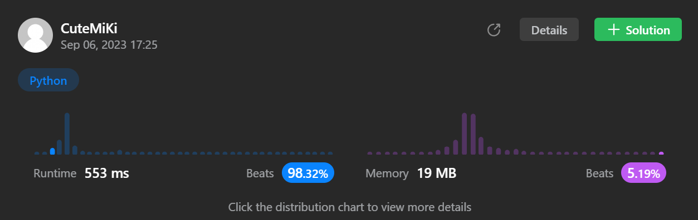

# 15. 3Sum
### Tag: [Medium](https://github.com/TheOnlyMiki/LeetCode-For-Fun/tree/main#medium-level), [Array](https://github.com/TheOnlyMiki/LeetCode-For-Fun/tree/main#array), [Two Pointers](https://github.com/TheOnlyMiki/LeetCode-For-Fun/tree/main#two-pointers), [Sorting](https://github.com/TheOnlyMiki/LeetCode-For-Fun/tree/main#sorting)
---
<div class="px-5 pt-4"><div class="flex"></div><div class="_1l1MA" data-track-load="description_content"><p>Given an integer array nums, return all the triplets <code>[nums[i], nums[j], nums[k]]</code> such that <code>i != j</code>, <code>i != k</code>, and <code>j != k</code>, and <code>nums[i] + nums[j] + nums[k] == 0</code>.</p>

<p>Notice that the solution set must not contain duplicate triplets.</p>

<p>&nbsp;</p>
<p><strong class="example">Example 1:</strong></p>

<pre><strong>Input:</strong> nums = [-1,0,1,2,-1,-4]
<strong>Output:</strong> [[-1,-1,2],[-1,0,1]]
<strong>Explanation:</strong> 
nums[0] + nums[1] + nums[2] = (-1) + 0 + 1 = 0.
nums[1] + nums[2] + nums[4] = 0 + 1 + (-1) = 0.
nums[0] + nums[3] + nums[4] = (-1) + 2 + (-1) = 0.
The distinct triplets are [-1,0,1] and [-1,-1,2].
Notice that the order of the output and the order of the triplets does not matter.
</pre>

<p><strong class="example">Example 2:</strong></p>

<pre><strong>Input:</strong> nums = [0,1,1]
<strong>Output:</strong> []
<strong>Explanation:</strong> The only possible triplet does not sum up to 0.
</pre>

<p><strong class="example">Example 3:</strong></p>

<pre><strong>Input:</strong> nums = [0,0,0]
<strong>Output:</strong> [[0,0,0]]
<strong>Explanation:</strong> The only possible triplet sums up to 0.
</pre>

<p>&nbsp;</p>
<p><strong>Constraints:</strong></p>

<ul>
	<li><code>3 &lt;= nums.length &lt;= 3000</code></li>
	<li><code>-10<sup>5</sup> &lt;= nums[i] &lt;= 10<sup>5</sup></code></li>
</ul>
</div></div>

---


### Solution

```python
class Solution(object):
    def positiveCheck(self, num):
            if num > 0:
                return True
            return False

    def threeSum(self, nums):
        """
        :type nums: List[int]
        :rtype: List[List[int]]
        """
        count = {}
        output = set()

        # Count the number of occurrences - O(n)
        for num in nums:
            if num in count:
                count[num] += 1
            else:
                count[num] = 1

        zero_exist = False
        if 0 in count:
            zero_exist = True
            if count[0] > 2:
                output.add((0,0,0))
            del count[0]

        record_count = count.keys() #List
        record_count_len = len(record_count)
            
        while record_count_len != 0:
            a = record_count[0]
            del record_count[0]
            record_count_len -= 1

            if zero_exist and -a in count:
                output.add(tuple(sorted([-a,0,a])))

            # a + b + c = 0 -> c = 0 - a - b
            for b in record_count:
                c = -a - b
                if c in count:
                    if a == b:
                        if count[a] > 1:
                            output.add(tuple(sorted([a,a,c])))
                    elif b == c:
                        if count[b] > 1:
                            output.add(tuple(sorted([a,b,b])))
                    elif a == c:
                        if count[a] > 1:
                            output.add(tuple(sorted([a,a,b])))
                    else:
                        output.add(tuple(sorted([a,b,c])))

        return output
```
