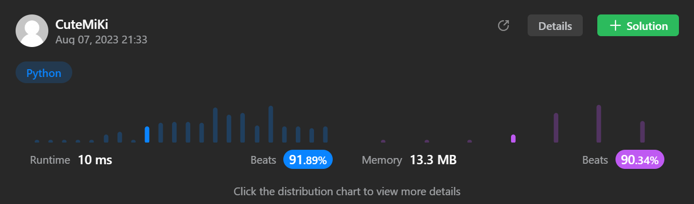

# 17. Letter Combinations of a Phone Number
### Tag: [Medium](https://github.com/TheOnlyMiki/LeetCode-For-Fun/tree/main#medium-level), [Hash Table](https://github.com/TheOnlyMiki/LeetCode-For-Fun/tree/main#hash-table), [String](https://github.com/TheOnlyMiki/LeetCode-For-Fun/tree/main#string), [Backtracking](https://github.com/TheOnlyMiki/LeetCode-For-Fun/tree/main#backtracking)
---
<div class="px-5 pt-4"><div class="flex"></div><div class="xFUwe" data-track-load="description_content"><p>Given a string containing digits from <code>2-9</code> inclusive, return all possible letter combinations that the number could represent. Return the answer in <strong>any order</strong>.</p>

<p>A mapping of digits to letters (just like on the telephone buttons) is given below. Note that 1 does not map to any letters.</p>

<p>&nbsp;</p>
<p><strong class="example">Example 1:</strong></p>

<pre><strong>Input:</strong> digits = "23"
<strong>Output:</strong> ["ad","ae","af","bd","be","bf","cd","ce","cf"]
</pre>

<p><strong class="example">Example 2:</strong></p>

<pre><strong>Input:</strong> digits = ""
<strong>Output:</strong> []
</pre>

<p><strong class="example">Example 3:</strong></p>

<pre><strong>Input:</strong> digits = "2"
<strong>Output:</strong> ["a","b","c"]
</pre>

<p>&nbsp;</p>
<p><strong>Constraints:</strong></p>

<ul>
	<li><code>0 &lt;= digits.length &lt;= 4</code></li>
	<li><code>digits[i]</code> is a digit in the range <code>['2', '9']</code>.</li>
</ul>
</div></div>

---


### Solution

```python
class Solution(object):
    def letterCombinations(self, digits):
        """
        :type digits: str
        :rtype: List[str]
        """
        represend = {
            '2' : ['a', 'b', 'c'],
            '3' : ['d', 'e', 'f'],
            '4' : ['g', 'h', 'i'],
            '5' : ['j', 'k', 'l'],
            '6' : ['m', 'n', 'o'],
            '7' : ['p', 'q', 'r', 's'],
            '8' : ['t', 'u', 'v'],
            '9' : ['w', 'x', 'y', 'z']
        }

        digits = list(digits)

        output = ['']
        temp = None
        for digit in digits:
            temp = []
            for item in output:
                temp.extend([ item + c for c in represend[digit] ])
            output = temp

        return ( output if output[0] != '' else [] )
```
