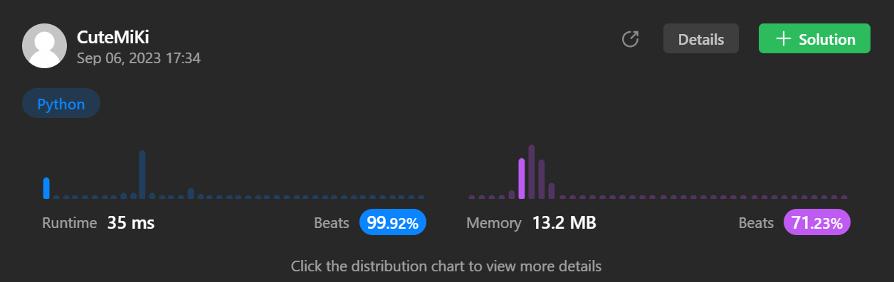

# 18. 4Sum
### Tag: [Medium](https://github.com/TheOnlyMiki/LeetCode-For-Fun/tree/main#medium-level), [Array](https://github.com/TheOnlyMiki/LeetCode-For-Fun/tree/main#array), [Two Pointers](https://github.com/TheOnlyMiki/LeetCode-For-Fun/tree/main#two-pointers), [Sorting](https://github.com/TheOnlyMiki/LeetCode-For-Fun/tree/main#sorting)
---
<div class="px-5 pt-4"><div class="flex"></div><div class="xFUwe" data-track-load="description_content"><p>Given an array <code>nums</code> of <code>n</code> integers, return <em>an array of all the <strong>unique</strong> quadruplets</em> <code>[nums[a], nums[b], nums[c], nums[d]]</code> such that:</p>

<ul>
	<li><code>0 &lt;= a, b, c, d&nbsp;&lt; n</code></li>
	<li><code>a</code>, <code>b</code>, <code>c</code>, and <code>d</code> are <strong>distinct</strong>.</li>
	<li><code>nums[a] + nums[b] + nums[c] + nums[d] == target</code></li>
</ul>

<p>You may return the answer in <strong>any order</strong>.</p>

<p>&nbsp;</p>
<p><strong class="example">Example 1:</strong></p>

<pre><strong>Input:</strong> nums = [1,0,-1,0,-2,2], target = 0
<strong>Output:</strong> [[-2,-1,1,2],[-2,0,0,2],[-1,0,0,1]]
</pre>

<p><strong class="example">Example 2:</strong></p>

<pre><strong>Input:</strong> nums = [2,2,2,2,2], target = 8
<strong>Output:</strong> [[2,2,2,2]]
</pre>

<p>&nbsp;</p>
<p><strong>Constraints:</strong></p>

<ul>
	<li><code>1 &lt;= nums.length &lt;= 200</code></li>
	<li><code>-10<sup>9</sup> &lt;= nums[i] &lt;= 10<sup>9</sup></code></li>
	<li><code>-10<sup>9</sup> &lt;= target &lt;= 10<sup>9</sup></code></li>
</ul>
</div></div>

---


### Solution

```python
class Solution(object):
    def fourSum(self, nums, target):
        """
        :type nums: List[int]
        :type target: int
        :rtype: List[List[int]]
        """
        length = len(nums)
        nums = sorted(nums)

        last_val = nums[-1]
        last_index = length-1
        # *** For the lower N, it won't see the improvement ***
        bound_last_val = { n : last_val * n for n in range(2, 4+1) }

        self.output, self.store = [], []

        def get_N_Sum(goal, left, n):
            # *** For the lower N, it won't see the improvement ***
            if goal < nums[left] * n or goal > bound_last_val[n]:
                return
            """
            if goal < nums[left] * n or goal > last_val * n:
                return
            """

            # Since the list had been sorted, then used two pointer method to find the result
            if n == 2:
                right, temp = last_index, None
                while left < right:
                    temp = nums[left] + nums[right]
                    if temp > goal:
                        right -= 1
                    elif temp < goal:
                        left += 1
                    else:
                        temp = nums[left]
                        self.output.append(self.store + [temp, nums[right]])
                        left += 1
                        while left < right and nums[left] == temp:
                            left += 1
                
                return

            for i in range(left, length - n + 1):
                if nums[i] != nums[i-1] or i == left:
                    self.store.append(nums[i])
                    get_N_Sum( goal - nums[i], i+1, n-1 )
                    self.store.pop()
        
        get_N_Sum(target, 0, 4)

        return self.output
```
