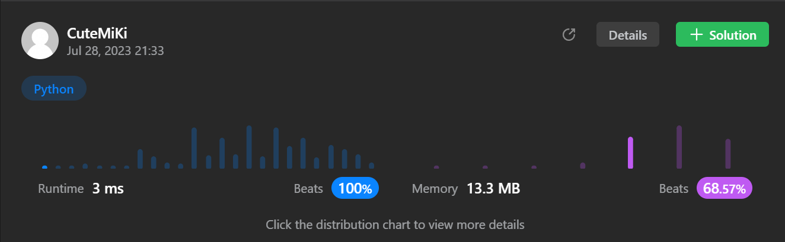

# 19. Remove Nth Node From End of List
### Tag: [Medium](https://github.com/TheOnlyMiki/LeetCode-For-Fun/tree/main#medium-level), [Linked List](https://github.com/TheOnlyMiki/LeetCode-For-Fun/tree/main#linked-list), [Two Pointers](https://github.com/TheOnlyMiki/LeetCode-For-Fun/tree/main#two-pointers)
---
<div class="px-5 pt-4"><div class="flex"></div><div class="_1l1MA" data-track-load="description_content"><p>Given the <code>head</code> of a linked list, remove the <code>n<sup>th</sup></code> node from the end of the list and return its head.</p>

<p>&nbsp;</p>
<p><strong class="example">Example 1:</strong></p>

<pre><strong>Input:</strong> head = [1,2,3,4,5], n = 2
<strong>Output:</strong> [1,2,3,5]
</pre>

<p><strong class="example">Example 2:</strong></p>

<pre><strong>Input:</strong> head = [1], n = 1
<strong>Output:</strong> []
</pre>

<p><strong class="example">Example 3:</strong></p>

<pre><strong>Input:</strong> head = [1,2], n = 1
<strong>Output:</strong> [1]
</pre>

<p>&nbsp;</p>
<p><strong>Constraints:</strong></p>

<ul>
	<li>The number of nodes in the list is <code>sz</code>.</li>
	<li><code>1 &lt;= sz &lt;= 30</code></li>
	<li><code>0 &lt;= Node.val &lt;= 100</code></li>
	<li><code>1 &lt;= n &lt;= sz</code></li>
</ul>

<p>&nbsp;</p>
<p><strong>Follow up:</strong> Could you do this in one pass?</p>
</div></div>

---


### Solution

```python
# Definition for singly-linked list.
# class ListNode(object):
#     def __init__(self, val=0, next=None):
#         self.val = val
#         self.next = next
class Solution(object):
    def removeNthFromEnd(self, head, n):
        """
        :type head: ListNode
        :type n: int
        :rtype: ListNode
        """

        if head.next is None: 
            return None

        i = 0
        record = ListNode(0, head)
        result_head = record
        delete_node = record

        while i < (n + 1):
            record = record.next
            i += 1

        while record:
            record = record.next
            i += 1
            delete_node = delete_node.next

        delete_node.next = delete_node.next.next

        return result_head.next
```
