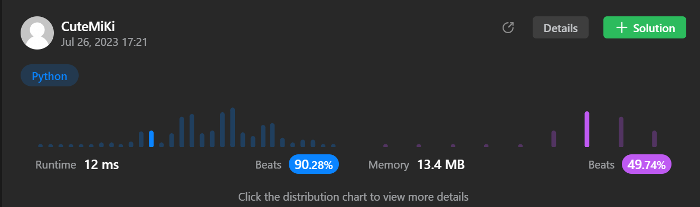

# 20. Valid Parentheses
### Tag: [Easy](https://github.com/TheOnlyMiki/LeetCode-For-Fun/tree/main#easy-level), [String](https://github.com/TheOnlyMiki/LeetCode-For-Fun/tree/main#string), [Stack](https://github.com/TheOnlyMiki/LeetCode-For-Fun/tree/main#stack)
---
<div class="px-5 pt-4"><div class="flex"></div><div class="_1l1MA" data-track-load="description_content"><p>Given a string <code>s</code> containing just the characters <code>'('</code>, <code>')'</code>, <code>'{'</code>, <code>'}'</code>, <code>'['</code> and <code>']'</code>, determine if the input string is valid.</p>

<p>An input string is valid if:</p>

<ol>
	<li>Open brackets must be closed by the same type of brackets.</li>
	<li>Open brackets must be closed in the correct order.</li>
	<li>Every close bracket has a corresponding open bracket of the same type.</li>
</ol>

<p>&nbsp;</p>
<p><strong class="example">Example 1:</strong></p>

<pre><strong>Input:</strong> s = "()"
<strong>Output:</strong> true
</pre>

<p><strong class="example">Example 2:</strong></p>

<pre><strong>Input:</strong> s = "()[]{}"
<strong>Output:</strong> true
</pre>

<p><strong class="example">Example 3:</strong></p>

<pre><strong>Input:</strong> s = "(]"
<strong>Output:</strong> false
</pre>

<p>&nbsp;</p>
<p><strong>Constraints:</strong></p>

<ul>
	<li><code>1 &lt;= s.length &lt;= 10<sup>4</sup></code></li>
	<li><code>s</code> consists of parentheses only <code>'()[]{}'</code>.</li>
</ul>
</div></div>

---


### Solution

```python
class Solution(object):
    def isValid(self, s):
        """
        :type s: str
        :rtype: bool
        """

        represent = {
            '(' : ')',
            '{' : '}',
            '[' : ']'
        }

        stack = []

        try:
            for c in s:
                if c in represent:
                    stack.append(represent[c])
                elif stack[-1] == c:
                    stack.pop()
                else:
                    return
        except:
            return False

        return len(stack) == 0
```
