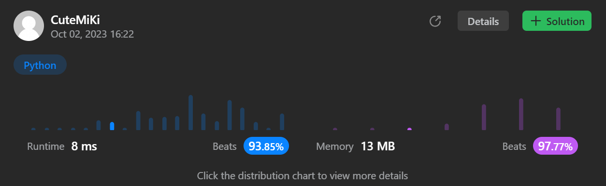

# 24. Swap Nodes in Pairs
### Tag: [Medium](https://github.com/TheOnlyMiki/LeetCode-For-Fun/tree/main#medium-level), [Linked List](https://github.com/TheOnlyMiki/LeetCode-For-Fun/tree/main#linked-list)
---
<div class="px-5 pt-4"><div class="flex"></div><div class="xFUwe" data-track-load="description_content"><p>Given a&nbsp;linked list, swap every two adjacent nodes and return its head. You must solve the problem without&nbsp;modifying the values in the list's nodes (i.e., only nodes themselves may be changed.)</p>

<p>&nbsp;</p>
<p><strong class="example">Example 1:</strong></p>

<pre><strong>Input:</strong> head = [1,2,3,4]
<strong>Output:</strong> [2,1,4,3]
</pre>

<p><strong class="example">Example 2:</strong></p>

<pre><strong>Input:</strong> head = []
<strong>Output:</strong> []
</pre>

<p><strong class="example">Example 3:</strong></p>

<pre><strong>Input:</strong> head = [1]
<strong>Output:</strong> [1]
</pre>

<p>&nbsp;</p>
<p><strong>Constraints:</strong></p>

<ul>
	<li>The number of nodes in the&nbsp;list&nbsp;is in the range <code>[0, 100]</code>.</li>
	<li><code>0 &lt;= Node.val &lt;= 100</code></li>
</ul>
</div></div>

---


### Solution

```python
# Definition for singly-linked list.
# class ListNode(object):
#     def __init__(self, val=0, next=None):
#         self.val = val
#         self.next = next
class Solution(object):
    def swapPairs(self, head):
        """
        :type head: ListNode
        :rtype: ListNode
        """
        # Option 2
        previou = final_head = ListNode(None, head)
        while head and head.next:
                head.next.next, head, previou.next.next, previou.next, previou = previou.next, head.next.next, head.next.next, head.next, previou.next

        return final_head.next

        # Option 1
        """
        final_head = ListNode(0, head)
        previou, current, even = final_head, head, False
        while current:
            if even:
                previou.next.next, previou.next, previou, current.next, current = current.next, current, previou.next, previou.next, current.next
            else:
                current = current.next
                
            even = not even

        return final_head.next
        """
```
