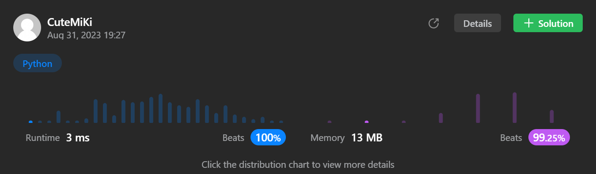

# 29. Divide Two Integers
### Tag: [Medium](https://github.com/TheOnlyMiki/LeetCode-For-Fun/tree/main#medium-level), [Math](https://github.com/TheOnlyMiki/LeetCode-For-Fun/tree/main#math), [Bit Manipulation](https://github.com/TheOnlyMiki/LeetCode-For-Fun/tree/main#bit-manipulation)
---
<div class="px-5 pt-4"><div class="flex"></div><div class="xFUwe" data-track-load="description_content"><p>Given two integers <code>dividend</code> and <code>divisor</code>, divide two integers <strong>without</strong> using multiplication, division, and mod operator.</p>

<p>The integer division should truncate toward zero, which means losing its fractional part. For example, <code>8.345</code> would be truncated to <code>8</code>, and <code>-2.7335</code> would be truncated to <code>-2</code>.</p>

<p>Return <em>the <strong>quotient</strong> after dividing </em><code>dividend</code><em> by </em><code>divisor</code>.</p>

<p><strong>Note: </strong>Assume we are dealing with an environment that could only store integers within the <strong>32-bit</strong> signed integer range: <code>[−2<sup>31</sup>, 2<sup>31</sup> − 1]</code>. For this problem, if the quotient is <strong>strictly greater than</strong> <code>2<sup>31</sup> - 1</code>, then return <code>2<sup>31</sup> - 1</code>, and if the quotient is <strong>strictly less than</strong> <code>-2<sup>31</sup></code>, then return <code>-2<sup>31</sup></code>.</p>

<p>&nbsp;</p>
<p><strong class="example">Example 1:</strong></p>

<pre><strong>Input:</strong> dividend = 10, divisor = 3
<strong>Output:</strong> 3
<strong>Explanation:</strong> 10/3 = 3.33333.. which is truncated to 3.
</pre>

<p><strong class="example">Example 2:</strong></p>

<pre><strong>Input:</strong> dividend = 7, divisor = -3
<strong>Output:</strong> -2
<strong>Explanation:</strong> 7/-3 = -2.33333.. which is truncated to -2.
</pre>

<p>&nbsp;</p>
<p><strong>Constraints:</strong></p>

<ul>
	<li><code>-2<sup>31</sup> &lt;= dividend, divisor &lt;= 2<sup>31</sup> - 1</code></li>
	<li><code>divisor != 0</code></li>
</ul>
</div></div>

---


### Solution

```python
class Solution(object):
    def divide(self, dividend, divisor):
        """
        :type dividend: int
        :type divisor: int
        :rtype: int
        """
        # Option 2 - Bit Operation
        output = 0
        if abs(divisor) == 1:
            output = dividend if divisor == 1 else -dividend
            limit = 2**31

            if output < -limit:
                return -limit
            if output >= limit:
                return limit-1

            return output
        
        x, y = abs(dividend), abs(divisor)
        for i in range(31, -1, -1):
            if (x >> i) - y >= 0:
                output += 1 << i
                x -= y << i

        return output if (dividend > 0) == (divisor > 0) else -output

        # Option 1 - Very Basic method, cannot pass
        """
        output = 0
        sign = 1
        limit = 2**31

        if divisor == 1:
            output = dividend
        elif divisor == -1:
            output = -dividend
        else:
            if dividend < 0:
                dividend = -dividend
                if divisor < 0:
                    divisor = -divisor
                else:
                    sign = -sign
            elif dividend > 0:
                if divisor < 0:
                    divisor, sign = -divisor, -sign
            
            while dividend >= divisor:
                dividend -= divisor
                output += sign

        if output < -limit:
            return -limit
        if output >= limit:
            return limit-1

        return output
        """
```
