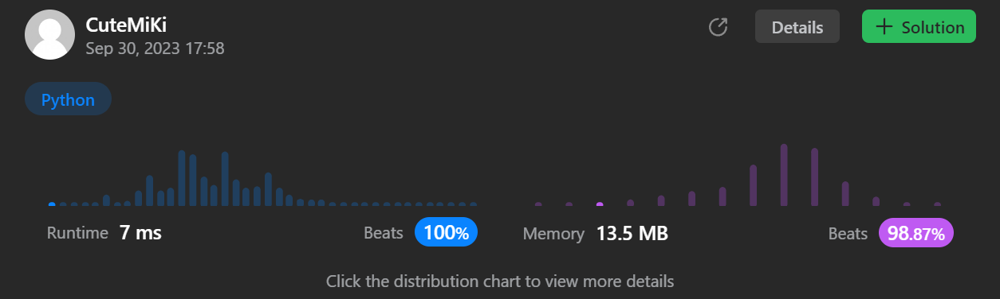

# 32. Longest Valid Parentheses
### Tag: [Hard](https://github.com/TheOnlyMiki/LeetCode-For-Fun/tree/main#hard-level), [String](https://github.com/TheOnlyMiki/LeetCode-For-Fun/tree/main#string), [Dynamic Programming](https://github.com/TheOnlyMiki/LeetCode-For-Fun/tree/main#dynamic-programming), [Stack](https://github.com/TheOnlyMiki/LeetCode-For-Fun/tree/main#stack)
---
<div class="px-5 pt-4"><div class="flex"></div><div class="xFUwe" data-track-load="description_content"><p>Given a string containing just the characters <code>'('</code> and <code>')'</code>, return <em>the length of the longest valid (well-formed) parentheses </em><span data-keyword="substring-nonempty" class=" cursor-pointer relative text-dark-blue-s text-sm"><div class="popover-wrapper inline-block" data-headlessui-state=""><div><div aria-expanded="false" data-headlessui-state="" id="headlessui-popover-button-:rq:"><div><em>substring</em></div></div><div style="position: fixed; z-index: 40; inset: 0px auto auto 0px; transform: translate(131px, 263px);"></div></div></div></span>.</p>

<p>&nbsp;</p>
<p><strong class="example">Example 1:</strong></p>

<pre><strong>Input:</strong> s = "(()"
<strong>Output:</strong> 2
<strong>Explanation:</strong> The longest valid parentheses substring is "()".
</pre>

<p><strong class="example">Example 2:</strong></p>

<pre><strong>Input:</strong> s = ")()())"
<strong>Output:</strong> 4
<strong>Explanation:</strong> The longest valid parentheses substring is "()()".
</pre>

<p><strong class="example">Example 3:</strong></p>

<pre><strong>Input:</strong> s = ""
<strong>Output:</strong> 0
</pre>

<p>&nbsp;</p>
<p><strong>Constraints:</strong></p>

<ul>
	<li><code>0 &lt;= s.length &lt;= 3 * 10<sup>4</sup></code></li>
	<li><code>s[i]</code> is <code>'('</code>, or <code>')'</code>.</li>
</ul>
</div></div>

---


### Solution

```python
class Solution(object):
    def longestValidParentheses(self, s):
        """
        :type s: str
        :rtype: int
        """
        if len(s) < 2:
            return 0

        count = [0] * len(s)
        output, temp = 0, None
        for i in range(1, len(s)):
            if s[i] == ')':
                if s[i-1] == ')':
                    temp = i - 1 - count[i-1]
                    if temp >= 0 and s[temp] == '(':
                        count[i] = count[i-1] + 2 + (count[temp-1] if temp-1 >= 0 else 0)
                        if count[i] > output:
                            output = count[i]
                else:
                    count[i] = count[i-2] + 2
                    if count[i] > output:
                        output = count[i]

        return output
```
