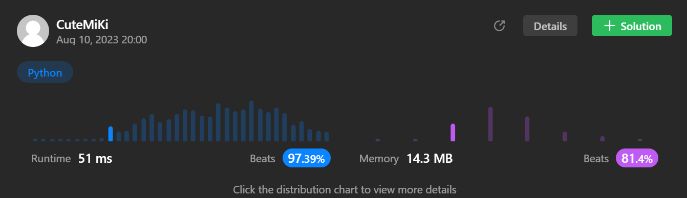

# 34. Find First and Last Position of Element in Sorted Array
### Tag: [Medium](https://github.com/TheOnlyMiki/LeetCode-For-Fun/tree/main#medium-level), [Array](https://github.com/TheOnlyMiki/LeetCode-For-Fun/tree/main#array), [Binary Search](https://github.com/TheOnlyMiki/LeetCode-For-Fun/tree/main#binary-search)
---
<div class="px-5 pt-4"><div class="flex"></div><div class="xFUwe" data-track-load="description_content"><p>Given an array of integers <code>nums</code> sorted in non-decreasing order, find the starting and ending position of a given <code>target</code> value.</p>

<p>If <code>target</code> is not found in the array, return <code>[-1, -1]</code>.</p>

<p>You must&nbsp;write an algorithm with&nbsp;<code>O(log n)</code> runtime complexity.</p>

<p>&nbsp;</p>
<p><strong class="example">Example 1:</strong></p>
<pre><strong>Input:</strong> nums = [5,7,7,8,8,10], target = 8
<strong>Output:</strong> [3,4]
</pre><p><strong class="example">Example 2:</strong></p>
<pre><strong>Input:</strong> nums = [5,7,7,8,8,10], target = 6
<strong>Output:</strong> [-1,-1]
</pre><p><strong class="example">Example 3:</strong></p>
<pre><strong>Input:</strong> nums = [], target = 0
<strong>Output:</strong> [-1,-1]
</pre>
<p>&nbsp;</p>
<p><strong>Constraints:</strong></p>

<ul>
	<li><code>0 &lt;= nums.length &lt;= 10<sup>5</sup></code></li>
	<li><code>-10<sup>9</sup>&nbsp;&lt;= nums[i]&nbsp;&lt;= 10<sup>9</sup></code></li>
	<li><code>nums</code> is a non-decreasing array.</li>
	<li><code>-10<sup>9</sup>&nbsp;&lt;= target&nbsp;&lt;= 10<sup>9</sup></code></li>
</ul>
</div></div>

---


### Solution

```python
class Solution(object):
    def searchRange(self, nums, target):
        """
        :type nums: List[int]
        :type target: int
        :rtype: List[int]
        """
        length = len(nums)
        if length == 0:
            return [-1, -1]

        self.output = [-1, -1]
        
        def findTarget(left, right, updateLeft, updateRight):
            if left <= right:
                mid = (left + right) // 2
                temp = nums[mid]
                if temp > target:
                    right = mid-1
                elif temp < target:
                    left = mid+1
                else:
                    # Update the most left index
                    if updateLeft:
                        self.output[0] = mid
                        findTarget(left, mid-1, True, False)
                    # Update the most right index
                    elif updateRight:
                        self.output[1] = mid
                        findTarget(mid+1, right, False, True)
                    # self.output == [-1, -1]
                    else:
                        self.output = [mid, mid]
                        findTarget(left, mid-1, True, False)
                        findTarget(mid+1, right, False, True)
                    return

                findTarget(left, right, updateLeft, updateRight)

        findTarget(0, length-1, False, False)
                
        return self.output
```
