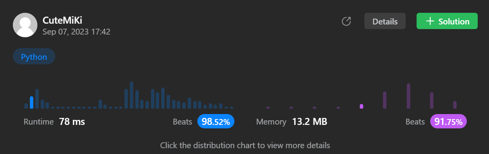

# 37. Sudoku Solver
### Tag: [Hard](https://github.com/TheOnlyMiki/LeetCode-For-Fun/tree/main#hard-level), [Array](https://github.com/TheOnlyMiki/LeetCode-For-Fun/tree/main#array), [Hash Table](https://github.com/TheOnlyMiki/LeetCode-For-Fun/tree/main#hash-table), [Backtracking](https://github.com/TheOnlyMiki/LeetCode-For-Fun/tree/main#backtracking), [Matrix](https://github.com/TheOnlyMiki/LeetCode-For-Fun/tree/main#matrix)
---
<div class="px-5 pt-4"><div class="flex"></div><div class="xFUwe" data-track-load="description_content"><p>Write a program to solve a Sudoku puzzle by filling the empty cells.</p>

<p>A sudoku solution must satisfy <strong>all of the following rules</strong>:</p>

<ol>
	<li>Each of the digits <code>1-9</code> must occur exactly once in each row.</li>
	<li>Each of the digits <code>1-9</code> must occur exactly once in each column.</li>
	<li>Each of the digits <code>1-9</code> must occur exactly once in each of the 9 <code>3x3</code> sub-boxes of the grid.</li>
</ol>

<p>The <code>'.'</code> character indicates empty cells.</p>

<p>&nbsp;</p>
<p><strong class="example">Example 1:</strong></p>

<pre><strong>Input:</strong> board = [["5","3",".",".","7",".",".",".","."],["6",".",".","1","9","5",".",".","."],[".","9","8",".",".",".",".","6","."],["8",".",".",".","6",".",".",".","3"],["4",".",".","8",".","3",".",".","1"],["7",".",".",".","2",".",".",".","6"],[".","6",".",".",".",".","2","8","."],[".",".",".","4","1","9",".",".","5"],[".",".",".",".","8",".",".","7","9"]]
<strong>Output:</strong> [["5","3","4","6","7","8","9","1","2"],["6","7","2","1","9","5","3","4","8"],["1","9","8","3","4","2","5","6","7"],["8","5","9","7","6","1","4","2","3"],["4","2","6","8","5","3","7","9","1"],["7","1","3","9","2","4","8","5","6"],["9","6","1","5","3","7","2","8","4"],["2","8","7","4","1","9","6","3","5"],["3","4","5","2","8","6","1","7","9"]]
<strong>Explanation:</strong>&nbsp;The input board is shown above and the only valid solution is shown below:


</pre>

<p>&nbsp;</p>
<p><strong>Constraints:</strong></p>

<ul>
	<li><code>board.length == 9</code></li>
	<li><code>board[i].length == 9</code></li>
	<li><code>board[i][j]</code> is a digit or <code>'.'</code>.</li>
	<li>It is <strong>guaranteed</strong> that the input board has only one solution.</li>
</ul>
</div></div>

---


### Solution

```python
class Solution(object):
    def solveSudoku(self, board):
        """
        :type board: List[List[str]]
        :rtype: None Do not return anything, modify board in-place instead.
        """
        area = { 
            (0,0) : set(), (0,1) : set(), (0,2) : set(), 
            (1,0) : set(), (1,1) : set(), (1,2) : set(), 
            (2,0) : set(), (2,1) : set(), (2,2) : set(), 
        }
        area_code = {0:0, 1:0, 2:0, 3:1, 4:1, 5:1, 6:2, 7:2, 8:2}

        horizontal = {}
        vertical = {}

        cols = range(9)
        for n in cols:
            horizontal[n] = set()
            vertical[n] = set()

        insertList = []
        for i in cols:
            for j in cols:
                if board[i][j] == '.':
                    insertList.append((i, j))
                else:
                    area[ (area_code[i], area_code[j]) ].add(board[i][j])
                    horizontal[i].add(board[i][j])
                    vertical[j].add(board[i][j])

        def solver():
            if not insertList:
                return True

            i, j = insertList.pop()

            for num in "123456789":
                # Check if the number is valid to insert to Sudoku
                if (num in horizontal[i] or num in vertical[j] or
                    num in area[ (area_code[i], area_code[j]) ]):
                    continue

                # Insert the valid number in to Sudoku and update the valid list
                board[i][j] = num
                area[ (area_code[i], area_code[j]) ].add(num)
                horizontal[i].add(num)
                vertical[j].add(num)

                if solver():
                    return True

                # Remove the number from Sudoku and valid list
                board[i][j] = '.'
                area[ (area_code[i], area_code[j]) ].remove(num)
                horizontal[i].remove(num)
                vertical[j].remove(num)

            insertList.append((i, j))
            
        solver()
```
