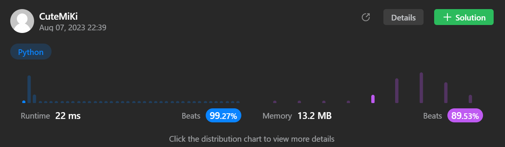

# 39. Combination Sum
### Tag: [Medium](https://github.com/TheOnlyMiki/LeetCode-For-Fun/tree/main#medium-level), [Array](https://github.com/TheOnlyMiki/LeetCode-For-Fun/tree/main#array), [Backtracking](https://github.com/TheOnlyMiki/LeetCode-For-Fun/tree/main#backtracking)
---
<div class="px-5 pt-4"><div class="flex"></div><div class="xFUwe" data-track-load="description_content"><p>Given an array of <strong>distinct</strong> integers <code>candidates</code> and a target integer <code>target</code>, return <em>a list of all <strong>unique combinations</strong> of </em><code>candidates</code><em> where the chosen numbers sum to </em><code>target</code><em>.</em> You may return the combinations in <strong>any order</strong>.</p>

<p>The <strong>same</strong> number may be chosen from <code>candidates</code> an <strong>unlimited number of times</strong>. Two combinations are unique if the <span data-keyword="frequency-array" class=" cursor-pointer relative text-dark-blue-s text-sm"><div class="popover-wrapper inline-block" data-headlessui-state=""><div><div id="headlessui-popover-button-:ru:" aria-expanded="false" data-headlessui-state="">frequency</div></div></div></span> of at least one of the chosen numbers is different.</p>

<p>The test cases are generated such that the number of unique combinations that sum up to <code>target</code> is less than <code>150</code> combinations for the given input.</p>

<p>&nbsp;</p>
<p><strong class="example">Example 1:</strong></p>

<pre><strong>Input:</strong> candidates = [2,3,6,7], target = 7
<strong>Output:</strong> [[2,2,3],[7]]
<strong>Explanation:</strong>
2 and 3 are candidates, and 2 + 2 + 3 = 7. Note that 2 can be used multiple times.
7 is a candidate, and 7 = 7.
These are the only two combinations.
</pre>

<p><strong class="example">Example 2:</strong></p>

<pre><strong>Input:</strong> candidates = [2,3,5], target = 8
<strong>Output:</strong> [[2,2,2,2],[2,3,3],[3,5]]
</pre>

<p><strong class="example">Example 3:</strong></p>

<pre><strong>Input:</strong> candidates = [2], target = 1
<strong>Output:</strong> []
</pre>

<p>&nbsp;</p>
<p><strong>Constraints:</strong></p>

<ul>
	<li><code>1 &lt;= candidates.length &lt;= 30</code></li>
	<li><code>2 &lt;= candidates[i] &lt;= 40</code></li>
	<li>All elements of <code>candidates</code> are <strong>distinct</strong>.</li>
	<li><code>1 &lt;= target &lt;= 40</code></li>
</ul>
</div></div>

---


### Solution

```python
class Solution(object):
    def combinationSum(self, candidates, target):
        """
        :type candidates: List[int]
        :type target: int
        :rtype: List[List[int]]
        """

        output = []
        length = len(candidates)

        def getNum(record, consum, index):
            if consum == target:
                output.append(record[:])
                return

            for i in xrange(index, length):
                consum += candidates[i]
                if consum <= target:
                    record.append(candidates[i])
                    getNum(record, consum, i)
                    record.pop()
                consum -= candidates[i]

        getNum([], 0, 0)

        return output
```
