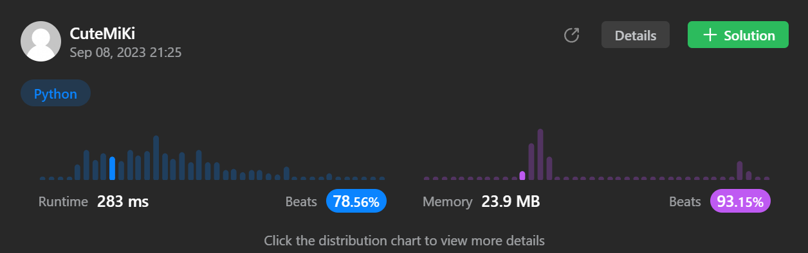

# 41. First Missing Positive
### Tag: [Hard](https://github.com/TheOnlyMiki/LeetCode-For-Fun/tree/main#hard-level), [Array](https://github.com/TheOnlyMiki/LeetCode-For-Fun/tree/main#array), [Hash Table](https://github.com/TheOnlyMiki/LeetCode-For-Fun/tree/main#hash-table)
---
<div class="px-5 pt-4"><div class="flex"></div><div class="xFUwe" data-track-load="description_content"><p>Given an unsorted integer array <code>nums</code>, return the smallest missing positive integer.</p>

<p>You must implement an algorithm that runs in <code>O(n)</code> time and uses <code>O(1)</code> auxiliary space.</p>

<p>&nbsp;</p>
<p><strong class="example">Example 1:</strong></p>

<pre><strong>Input:</strong> nums = [1,2,0]
<strong>Output:</strong> 3
<strong>Explanation:</strong> The numbers in the range [1,2] are all in the array.
</pre>

<p><strong class="example">Example 2:</strong></p>

<pre><strong>Input:</strong> nums = [3,4,-1,1]
<strong>Output:</strong> 2
<strong>Explanation:</strong> 1 is in the array but 2 is missing.
</pre>

<p><strong class="example">Example 3:</strong></p>

<pre><strong>Input:</strong> nums = [7,8,9,11,12]
<strong>Output:</strong> 1
<strong>Explanation:</strong> The smallest positive integer 1 is missing.
</pre>

<p>&nbsp;</p>
<p><strong>Constraints:</strong></p>

<ul>
	<li><code>1 &lt;= nums.length &lt;= 10<sup>5</sup></code></li>
	<li><code>-2<sup>31</sup> &lt;= nums[i] &lt;= 2<sup>31</sup> - 1</code></li>
</ul>
</div></div>

---


### Solution

```python
class Solution(object):
    def firstMissingPositive(self, nums):
        """
        :type nums: List[int]
        :rtype: int
        """
        length = len(nums)
        i = 0
        num = None
        while i < length:
            num = nums[i]
            if 0 < num < length and nums[num-1] != num:
                nums[i], nums[num-1] = nums[num-1], num
            else:
                i += 1

        for i, num in enumerate(nums, start=1):
            if num != i:
                return i

        return length+1
```
