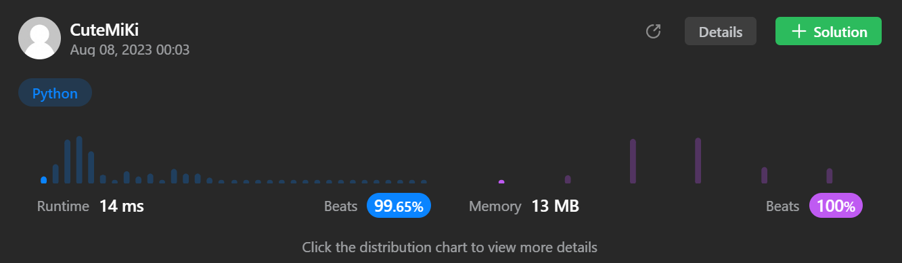

# 52. N-Queens II
### Tag: [Hard](https://github.com/TheOnlyMiki/LeetCode-For-Fun/tree/main#hard-level), [Array](https://github.com/TheOnlyMiki/LeetCode-For-Fun/tree/main#array), [Math](https://github.com/TheOnlyMiki/LeetCode-For-Fun/tree/main#math), [Backtracking](https://github.com/TheOnlyMiki/LeetCode-For-Fun/tree/main#backtracking)
---
<div class="px-5 pt-4"><div class="flex"></div><div class="xFUwe" data-track-load="description_content"><p>The <strong>n-queens</strong> puzzle is the problem of placing <code>n</code> queens on an <code>n x n</code> chessboard such that no two queens attack each other.</p>

<p>Given an integer <code>n</code>, return <em>the number of distinct solutions to the&nbsp;<strong>n-queens puzzle</strong></em>.</p>

<p>&nbsp;</p>
<p><strong class="example">Example 1:</strong></p>

<pre><strong>Input:</strong> n = 4
<strong>Output:</strong> 2
<strong>Explanation:</strong> There are two distinct solutions to the 4-queens puzzle as shown.
</pre>

<p><strong class="example">Example 2:</strong></p>

<pre><strong>Input:</strong> n = 1
<strong>Output:</strong> 1
</pre>

<p>&nbsp;</p>
<p><strong>Constraints:</strong></p>

<ul>
	<li><code>1 &lt;= n &lt;= 9</code></li>
</ul>
</div></div>

---


### Solution

```python
class Solution(object):
    def totalNQueens(self, n):
        """
        :type n: int
        :rtype: int
        """

        self.output = 2*n
        cols = range(n)
        invalidCols = [False]*n
        invalidAngle, invalidAntiAngle = [False]*self.output, [False]*self.output

        def getNumQueen(row):
            if row == n:
                self.output += 1
                return

            for col in cols:
                angle, antiAngle = col - row + n, col + row
                if invalidCols[col] or invalidAngle[angle] or invalidAntiAngle[antiAngle]:
                    continue
                invalidCols[col] = invalidAngle[angle] = invalidAntiAngle[antiAngle] = True
                getNumQueen(row+1)
                invalidCols[col] = invalidAngle[angle] = invalidAntiAngle[antiAngle] = False

        self.output = 0
        getNumQueen(0)

        return self.output
```
