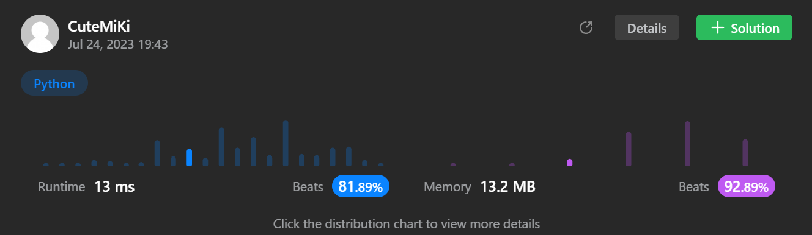

# 54. Spiral Matrix
### Tag: [Medium](https://github.com/TheOnlyMiki/LeetCode-For-Fun/tree/main#medium-level), [Array](https://github.com/TheOnlyMiki/LeetCode-For-Fun/tree/main#array), [Matrix](https://github.com/TheOnlyMiki/LeetCode-For-Fun/tree/main#matrix)
---
<div class="px-5 pt-4"><div class="flex"></div><div class="_1l1MA" data-track-load="description_content"><p>Given an <code>m x n</code> <code>matrix</code>, return <em>all elements of the</em> <code>matrix</code> <em>in spiral order</em>.</p>

<p>&nbsp;</p>
<p><strong class="example">Example 1:</strong></p>

<pre><strong>Input:</strong> matrix = [[1,2,3],[4,5,6],[7,8,9]]
<strong>Output:</strong> [1,2,3,6,9,8,7,4,5]
</pre>

<p><strong class="example">Example 2:</strong></p>

<pre><strong>Input:</strong> matrix = [[1,2,3,4],[5,6,7,8],[9,10,11,12]]
<strong>Output:</strong> [1,2,3,4,8,12,11,10,9,5,6,7]
</pre>

<p>&nbsp;</p>
<p><strong>Constraints:</strong></p>

<ul>
	<li><code>m == matrix.length</code></li>
	<li><code>n == matrix[i].length</code></li>
	<li><code>1 &lt;= m, n &lt;= 10</code></li>
	<li><code>-100 &lt;= matrix[i][j] &lt;= 100</code></li>
</ul>
</div></div>

---


### Solution

```python
class Solution(object):
    def spiralOrder(self, matrix):
        """
        :type matrix: List[List[int]]
        :rtype: List[int]
        """
        m = len(matrix)
        n = len(matrix[0])

        elements = m * n

        output = []
        
        left = 0
        right = n - 1
        top = 0
        bottom = m - 1

        direction = 0

        while len(output) != elements:
            direction = direction % 4
            # Handle left to right
            if direction == 0:
                output.extend(matrix[top][ left : right+1 ])
                top += 1
            # Handle top to bottom
            elif direction == 1:
                for i in range(top, bottom + 1):
                    output.append(matrix[i][right])
                right -= 1
            # Handle right to left
            elif direction == 2:
                temp = matrix[bottom][ left : right+1 ]
                output.extend(temp[::-1])
                bottom -= 1
            # Handle bottom to top
            else:
                for i in range(bottom, top - 1, -1):
                    output.append(matrix[i][left])
                left += 1
            
            direction += 1

        return output
```
