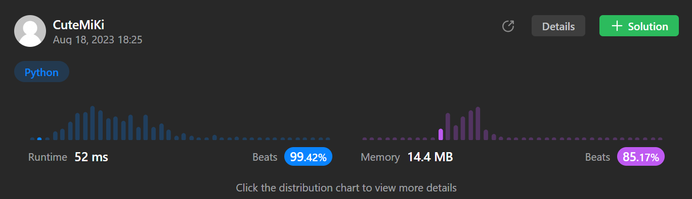

# 64. Minimum Path Sum
### Tag: [Medium](https://github.com/TheOnlyMiki/LeetCode-For-Fun/tree/main#medium-level), [Array](https://github.com/TheOnlyMiki/LeetCode-For-Fun/tree/main#array), [Dynamic Programming](https://github.com/TheOnlyMiki/LeetCode-For-Fun/tree/main#dynamic-programming), [Matrix](https://github.com/TheOnlyMiki/LeetCode-For-Fun/tree/main#matrix)
---
<div class="px-5 pt-4"><div class="flex"></div><div class="xFUwe" data-track-load="description_content"><p>Given a <code>m x n</code> <code>grid</code> filled with non-negative numbers, find a path from top left to bottom right, which minimizes the sum of all numbers along its path.</p>

<p><strong>Note:</strong> You can only move either down or right at any point in time.</p>

<p>&nbsp;</p>
<p><strong class="example">Example 1:</strong></p>

<pre><strong>Input:</strong> grid = [[1,3,1],[1,5,1],[4,2,1]]
<strong>Output:</strong> 7
<strong>Explanation:</strong> Because the path 1 → 3 → 1 → 1 → 1 minimizes the sum.
</pre>

<p><strong class="example">Example 2:</strong></p>

<pre><strong>Input:</strong> grid = [[1,2,3],[4,5,6]]
<strong>Output:</strong> 12
</pre>

<p>&nbsp;</p>
<p><strong>Constraints:</strong></p>

<ul>
	<li><code>m == grid.length</code></li>
	<li><code>n == grid[i].length</code></li>
	<li><code>1 &lt;= m, n &lt;= 200</code></li>
	<li><code>0 &lt;= grid[i][j] &lt;= 200</code></li>
</ul>
</div></div>

---


### Solution

```python
class Solution(object):
    def minPathSum(self, grid):
        """
        :type grid: List[List[int]]
        :rtype: int
        """
        m, n = len(grid), len(grid[0])
        rows, cols = range(1,m), range(1,n)

        for x in rows:
            grid[x][0] += grid[x-1][0]
        for y in cols:
            grid[0][y] += grid[0][y-1]

        top = None
        for x in rows:
            top = x-1
            for y in cols:
                
                grid[x][y] += min(grid[top][y], grid[x][y-1])

        return grid[-1][-1]
```
