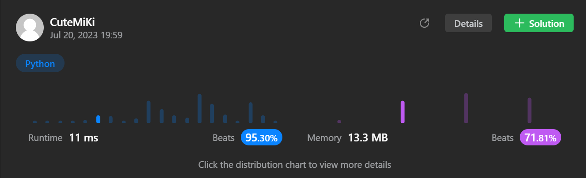

# 68. Text Justification
### Tag: [Hard](https://github.com/TheOnlyMiki/LeetCode-For-Fun/tree/main#hard-level), [Array](https://github.com/TheOnlyMiki/LeetCode-For-Fun/tree/main#array), [String](https://github.com/TheOnlyMiki/LeetCode-For-Fun/tree/main#string)
---
<div class="px-5 pt-4"><div class="flex"></div><div class="_1l1MA" data-track-load="description_content"><p>Given an array of strings <code>words</code> and a width <code>maxWidth</code>, format the text such that each line has exactly <code>maxWidth</code> characters and is fully (left and right) justified.</p>

<p>You should pack your words in a greedy approach; that is, pack as many words as you can in each line. Pad extra spaces <code>' '</code> when necessary so that each line has exactly <code>maxWidth</code> characters.</p>

<p>Extra spaces between words should be distributed as evenly as possible. If the number of spaces on a line does not divide evenly between words, the empty slots on the left will be assigned more spaces than the slots on the right.</p>

<p>For the last line of text, it should be left-justified, and no extra space is inserted between words.</p>

<p><strong>Note:</strong></p>

<ul>
	<li>A word is defined as a character sequence consisting of non-space characters only.</li>
	<li>Each word's length is guaranteed to be greater than <code>0</code> and not exceed <code>maxWidth</code>.</li>
	<li>The input array <code>words</code> contains at least one word.</li>
</ul>

<p>&nbsp;</p>
<p><strong class="example">Example 1:</strong></p>

<pre><strong>Input:</strong> words = ["This", "is", "an", "example", "of", "text", "justification."], maxWidth = 16
<strong>Output:</strong>
[
&nbsp; &nbsp;"This &nbsp; &nbsp;is &nbsp; &nbsp;an",
&nbsp; &nbsp;"example &nbsp;of text",
&nbsp; &nbsp;"justification. &nbsp;"
]</pre>

<p><strong class="example">Example 2:</strong></p>

<pre><strong>Input:</strong> words = ["What","must","be","acknowledgment","shall","be"], maxWidth = 16
<strong>Output:</strong>
[
&nbsp; "What &nbsp; must &nbsp; be",
&nbsp; "acknowledgment &nbsp;",
&nbsp; "shall be &nbsp; &nbsp; &nbsp; &nbsp;"
]
<strong>Explanation:</strong> Note that the last line is "shall be    " instead of "shall     be", because the last line must be left-justified instead of fully-justified.
Note that the second line is also left-justified because it contains only one word.</pre>

<p><strong class="example">Example 3:</strong></p>

<pre><strong>Input:</strong> words = ["Science","is","what","we","understand","well","enough","to","explain","to","a","computer.","Art","is","everything","else","we","do"], maxWidth = 20
<strong>Output:</strong>
[
&nbsp; "Science &nbsp;is &nbsp;what we",
  "understand &nbsp; &nbsp; &nbsp;well",
&nbsp; "enough to explain to",
&nbsp; "a &nbsp;computer. &nbsp;Art is",
&nbsp; "everything &nbsp;else &nbsp;we",
&nbsp; "do &nbsp; &nbsp; &nbsp; &nbsp; &nbsp; &nbsp; &nbsp; &nbsp; &nbsp;"
]</pre>

<p>&nbsp;</p>
<p><strong>Constraints:</strong></p>

<ul>
	<li><code>1 &lt;= words.length &lt;= 300</code></li>
	<li><code>1 &lt;= words[i].length &lt;= 20</code></li>
	<li><code>words[i]</code> consists of only English letters and symbols.</li>
	<li><code>1 &lt;= maxWidth &lt;= 100</code></li>
	<li><code>words[i].length &lt;= maxWidth</code></li>
</ul>
</div></div>

---


### Solution

```python
class Solution(object):
    def fullJustify(self, words, maxWidth):
        """
        :type words: List[str]
        :type maxWidth: int
        :rtype: List[str]
        """

        space = 0
        count = 0
        record_last_line = []
        output = []

        for i, word in enumerate(words):
            length = len(word)

            # Already have + current word + spaces of ' ' needs
            if count + length + space > maxWidth:
                # Find out the remaining spaces
                remain_space = maxWidth - count
                pre_line = ""

                # Make line - if there is only one word in line handle by EXCEPT
                try:
                    # Calculate the needs of spaces and if there is addition necessary
                    # If there is 6 remain spaces, and there is 3 words (which is mean 
                    # a least need 3 spaces if there is new word is joining), so 6 / 
                    # (3 - 1) = 6 / 2, cause there is only 2 spaces between 3 words.
                    space_needs = remain_space // (space-1)
                    addition_space = remain_space % (space-1)
                    # Create a space of " " then join together
                    pre_line = str((" " * space_needs).join( words[ i-space : i ] ))
                    # Get the first index for insert space if necessary
                    remain_space = record_last_line[0]
                    for index in range(addition_space):
                        pre_line = pre_line[:remain_space] + " " + pre_line[remain_space:]
                        remain_space += record_last_line[index+1] + space_needs + 1
                # Handle the Case - Only one word in last line
                except:
                    pre_line = str(words[i-1] + " " * remain_space)

                # Store the complete result of last line
                output.append(pre_line)
                #Initial for next iteration
                record_last_line = []
                space = count = 0

            # Iteration update
            record_last_line.append(length)
            count += length
            space += 1

        # Handle the last line
        last_line = str( " ".join(words[-space:]) )
        remain_space = maxWidth - len(last_line)
        output.append(last_line + " " * remain_space)

        return output
```
