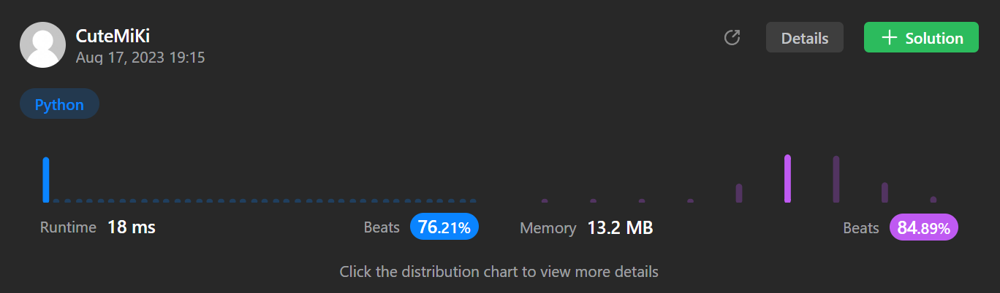

# 69. Sqrt(x)
### Tag: [Easy](https://github.com/TheOnlyMiki/LeetCode-For-Fun/tree/main#easy-level), [Math](https://github.com/TheOnlyMiki/LeetCode-For-Fun/tree/main#math), [Binary Search](https://github.com/TheOnlyMiki/LeetCode-For-Fun/tree/main#binary-search)
---
<div class="px-5 pt-4"><div class="flex"></div><div class="xFUwe" data-track-load="description_content"><p>Given a non-negative integer <code>x</code>, return <em>the square root of </em><code>x</code><em> rounded down to the nearest integer</em>. The returned integer should be <strong>non-negative</strong> as well.</p>

<p>You <strong>must not use</strong> any built-in exponent function or operator.</p>

<ul>
	<li>For example, do not use <code>pow(x, 0.5)</code> in c++ or <code>x ** 0.5</code> in python.</li>
</ul>

<p>&nbsp;</p>
<p><strong class="example">Example 1:</strong></p>

<pre><strong>Input:</strong> x = 4
<strong>Output:</strong> 2
<strong>Explanation:</strong> The square root of 4 is 2, so we return 2.
</pre>

<p><strong class="example">Example 2:</strong></p>

<pre><strong>Input:</strong> x = 8
<strong>Output:</strong> 2
<strong>Explanation:</strong> The square root of 8 is 2.82842..., and since we round it down to the nearest integer, 2 is returned.
</pre>

<p>&nbsp;</p>
<p><strong>Constraints:</strong></p>

<ul>
	<li><code>0 &lt;= x &lt;= 2<sup>31</sup> - 1</code></li>
</ul>
</div></div>

---


### Solution

```python
class Solution(object):
    def mySqrt(self, x):
        """
        :type x: int
        :rtype: int
        """
        left = 0
        right = x
        mid = None
        temp = None
        while left <= right:
            mid = (left + right) / 2
            temp = mid*mid
            if temp < x:
                left = mid+1
            elif temp > x:
                right = mid-1
            else:
                return mid

        return left-1
```
