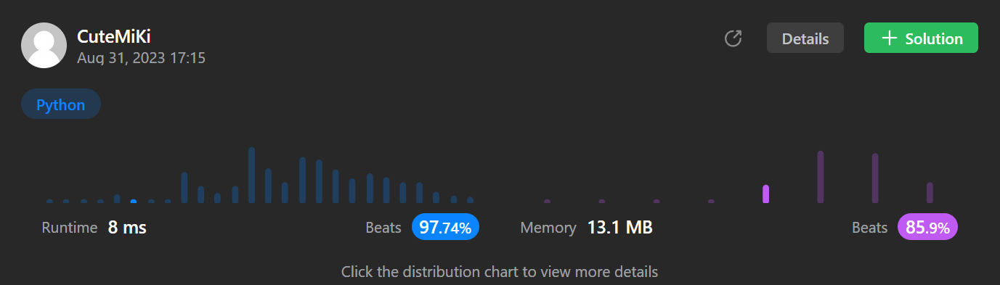

# 75. Sort Colors
### Tag: [Medium](https://github.com/TheOnlyMiki/LeetCode-For-Fun/tree/main#medium-level), [Array](https://github.com/TheOnlyMiki/LeetCode-For-Fun/tree/main#array), [Two Pointers](https://github.com/TheOnlyMiki/LeetCode-For-Fun/tree/main#two-pointers), [Sorting](https://github.com/TheOnlyMiki/LeetCode-For-Fun/tree/main#sorting)
---
<div class="px-5 pt-4"><div class="flex"></div><div class="xFUwe" data-track-load="description_content"><p>Given an array <code>nums</code> with <code>n</code> objects colored red, white, or blue, sort them <strong><a href="https://en.wikipedia.org/wiki/In-place_algorithm" target="_blank">in-place</a> </strong>so that objects of the same color are adjacent, with the colors in the order red, white, and blue.</p>

<p>We will use the integers <code>0</code>, <code>1</code>, and <code>2</code> to represent the color red, white, and blue, respectively.</p>

<p>You must solve this problem without using the library's sort function.</p>

<p>&nbsp;</p>
<p><strong class="example">Example 1:</strong></p>

<pre><strong>Input:</strong> nums = [2,0,2,1,1,0]
<strong>Output:</strong> [0,0,1,1,2,2]
</pre>

<p><strong class="example">Example 2:</strong></p>

<pre><strong>Input:</strong> nums = [2,0,1]
<strong>Output:</strong> [0,1,2]
</pre>

<p>&nbsp;</p>
<p><strong>Constraints:</strong></p>

<ul>
	<li><code>n == nums.length</code></li>
	<li><code>1 &lt;= n &lt;= 300</code></li>
	<li><code>nums[i]</code> is either <code>0</code>, <code>1</code>, or <code>2</code>.</li>
</ul>

<p>&nbsp;</p>
<p><strong>Follow up:</strong>&nbsp;Could you come up with a one-pass algorithm using only&nbsp;constant extra space?</p>
</div></div>

---


### Solution

```python
class Solution(object):
    def sortColors(self, nums):
        """
        :type nums: List[int]
        :rtype: None Do not return anything, modify nums in-place instead.
        """
        index_0_insert, left, right = 0, 0, len(nums)-1

        while left <= right:
            if nums[left] == 0:
                nums[left], nums[index_0_insert] = nums[index_0_insert], nums[left]
                index_0_insert += 1
                left += 1
            elif nums[left] == 1:
                left += 1
            else:
                nums[right], nums[left] = nums[left], nums[right]
                right -= 1
```
