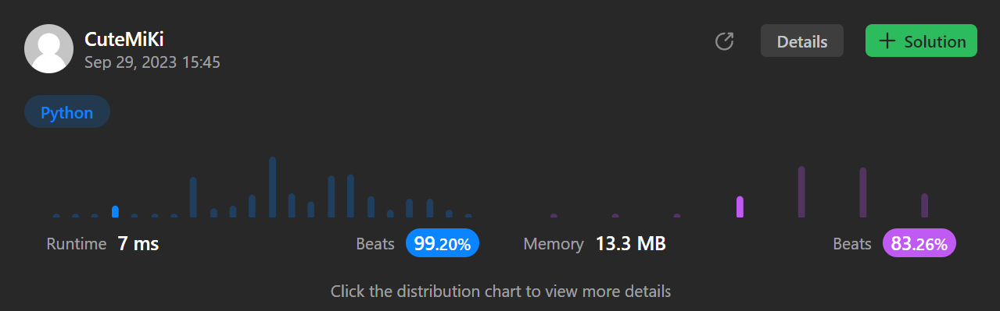

# 78. Subsets
### Tag: [Medium](https://github.com/TheOnlyMiki/LeetCode-For-Fun/tree/main#medium-level), [Array](https://github.com/TheOnlyMiki/LeetCode-For-Fun/tree/main#array), [Backtracking](https://github.com/TheOnlyMiki/LeetCode-For-Fun/tree/main#backtracking), [Bit Manipulation](https://github.com/TheOnlyMiki/LeetCode-For-Fun/tree/main#bit-manipulation)
---
<div class="px-5 pt-4"><div class="flex"></div><div class="xFUwe" data-track-load="description_content"><p>Given an integer array <code>nums</code> of <strong>unique</strong> elements, return <em>all possible</em> <span data-keyword="subset" class=" cursor-pointer relative text-dark-blue-s text-sm"><div class="popover-wrapper inline-block" data-headlessui-state=""><div><div aria-expanded="false" data-headlessui-state="" id="headlessui-popover-button-:rm:"><div><em>subsets</em></div></div><div style="position: fixed; z-index: 40; inset: 0px auto auto 0px; transform: translate(120px, 242px);"></div></div></div></span> <em>(the power set)</em>.</p>

<p>The solution set <strong>must not</strong> contain duplicate subsets. Return the solution in <strong>any order</strong>.</p>

<p>&nbsp;</p>
<p><strong class="example">Example 1:</strong></p>

<pre><strong>Input:</strong> nums = [1,2,3]
<strong>Output:</strong> [[],[1],[2],[1,2],[3],[1,3],[2,3],[1,2,3]]
</pre>

<p><strong class="example">Example 2:</strong></p>

<pre><strong>Input:</strong> nums = [0]
<strong>Output:</strong> [[],[0]]
</pre>

<p>&nbsp;</p>
<p><strong>Constraints:</strong></p>

<ul>
	<li><code>1 &lt;= nums.length &lt;= 10</code></li>
	<li><code>-10 &lt;= nums[i] &lt;= 10</code></li>
	<li>All the numbers of&nbsp;<code>nums</code> are <strong>unique</strong>.</li>
</ul>
</div></div>

---


### Solution

```python
class Solution(object):
    def subsets(self, nums):
        """
        :type nums: List[int]
        :rtype: List[List[int]]
        """
        length = len(nums)
        self.output = []
        def dfs(start, store):
            self.output.append(store)
            for i in range(start, length):
                dfs(i+1, store + [nums[i]])
        
        dfs(0, [])
        return self.output
```
