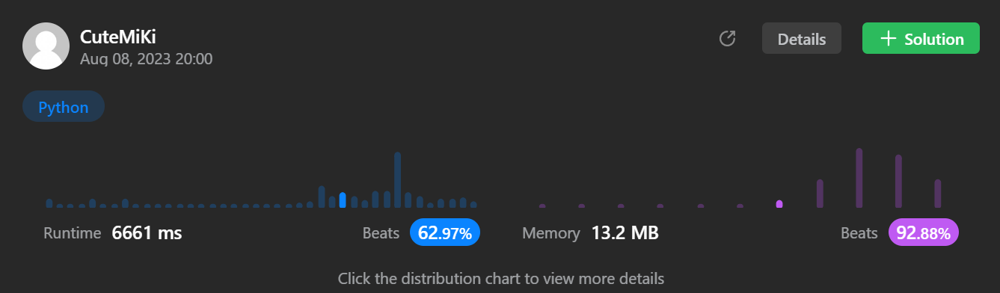

# 79. Word Search
### Tag: [Medium](https://github.com/TheOnlyMiki/LeetCode-For-Fun/tree/main#medium-level), [Array](https://github.com/TheOnlyMiki/LeetCode-For-Fun/tree/main#array), [Matrix](https://github.com/TheOnlyMiki/LeetCode-For-Fun/tree/main#matrix), [Backtracking](https://github.com/TheOnlyMiki/LeetCode-For-Fun/tree/main#backtracking)
---
<div class="px-5 pt-4"><div class="flex"></div><div class="xFUwe" data-track-load="description_content"><p>Given an <code>m x n</code> grid of characters <code>board</code> and a string <code>word</code>, return <code>true</code> <em>if</em> <code>word</code> <em>exists in the grid</em>.</p>

<p>The word can be constructed from letters of sequentially adjacent cells, where adjacent cells are horizontally or vertically neighboring. The same letter cell may not be used more than once.</p>

<p>&nbsp;</p>
<p><strong class="example">Example 1:</strong></p>

<pre><strong>Input:</strong> board = [["A","B","C","E"],["S","F","C","S"],["A","D","E","E"]], word = "ABCCED"
<strong>Output:</strong> true
</pre>

<p><strong class="example">Example 2:</strong></p>

<pre><strong>Input:</strong> board = [["A","B","C","E"],["S","F","C","S"],["A","D","E","E"]], word = "SEE"
<strong>Output:</strong> true
</pre>

<p><strong class="example">Example 3:</strong></p>

<pre><strong>Input:</strong> board = [["A","B","C","E"],["S","F","C","S"],["A","D","E","E"]], word = "ABCB"
<strong>Output:</strong> false
</pre>

<p>&nbsp;</p>
<p><strong>Constraints:</strong></p>

<ul>
	<li><code>m == board.length</code></li>
	<li><code>n = board[i].length</code></li>
	<li><code>1 &lt;= m, n &lt;= 6</code></li>
	<li><code>1 &lt;= word.length &lt;= 15</code></li>
	<li><code>board</code> and <code>word</code> consists of only lowercase and uppercase English letters.</li>
</ul>

<p>&nbsp;</p>
<p><strong>Follow up:</strong> Could you use search pruning to make your solution faster with a larger <code>board</code>?</p>
</div></div>

---


### Solution

```python
class Solution(object):
    def exist(self, board, word):
        """
        :type board: List[List[str]]
        :type word: str
        :rtype: bool
        """
        
        length = len(word)

        m = len(board)
        n = len(board[0])
        cols = range(n)

        def checkWord(x, y, i):
            c = board[x][y]
            board[x][y] = None

            if i == length:
                return True

            for a, b in [(-1, 0), (1, 0), (0, -1), (0, 1)]:
                next_x, next_y = x+a, y+b
                if -1 < next_x < m and -1 < next_y < n and board[next_x][next_y] == word[i]:
                    if checkWord(next_x, next_y, i+1):
                        return True

            board[x][y] = c
            return False

        for x in range(m):
            for y in cols:
                if board[x][y] == word[0] and checkWord(x, y, 1):
                    return True

        return False
```
