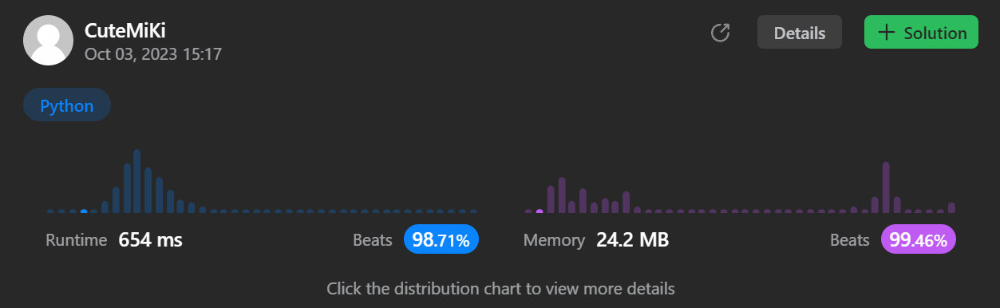

# 84. Largest Rectangle in Histogram
### Tag: [Hard](https://github.com/TheOnlyMiki/LeetCode-For-Fun/tree/main#hard-level), [Array](https://github.com/TheOnlyMiki/LeetCode-For-Fun/tree/main#array), [Stack](https://github.com/TheOnlyMiki/LeetCode-For-Fun/tree/main#stack)
---
<div class="px-5 pt-4"><div class="flex"></div><div class="xFUwe" data-track-load="description_content"><p>Given an array of integers <code>heights</code> representing the histogram's bar height where the width of each bar is <code>1</code>, return <em>the area of the largest rectangle in the histogram</em>.</p>

<p>&nbsp;</p>
<p><strong class="example">Example 1:</strong></p>

<pre><strong>Input:</strong> heights = [2,1,5,6,2,3]
<strong>Output:</strong> 10
<strong>Explanation:</strong> The above is a histogram where width of each bar is 1.
The largest rectangle is shown in the red area, which has an area = 10 units.
</pre>

<p><strong class="example">Example 2:</strong></p>

<pre><strong>Input:</strong> heights = [2,4]
<strong>Output:</strong> 4
</pre>

<p>&nbsp;</p>
<p><strong>Constraints:</strong></p>

<ul>
	<li><code>1 &lt;= heights.length &lt;= 10<sup>5</sup></code></li>
	<li><code>0 &lt;= heights[i] &lt;= 10<sup>4</sup></code></li>
</ul>
</div></div>

---


### Solution

```python
class Solution(object):
    def largestRectangleArea(self, heights):
        """
        :type heights: List[int]
        :rtype: int
        """
        # Option 2
        output = 0
        stack = [-1]
        heights.append(0)
        for i, h in enumerate(heights):
            while heights[stack[-1]] > h:
                height = heights[stack.pop()]
                if output < height * (i - stack[-1] - 1):
                    output = height * (i - stack[-1] - 1)
            
            stack.append(i)

        return output

        # Option 1
        """
        output = 0
        stack = [(0, -1)]
        for i, h in enumerate(heights):
            while stack[-1][0] > h:
                height = stack.pop()[0]
                area = height * (i - 1 - stack[-1][1])
                if output < area:
                    output = area
            
            stack.append((h, i))

        while stack[-1][0] > 0:
            height = stack.pop()[0]
            area = height * (len(heights) - 1 - stack[-1][1])
            if output < area:
                output = area

        return output
        """
```
