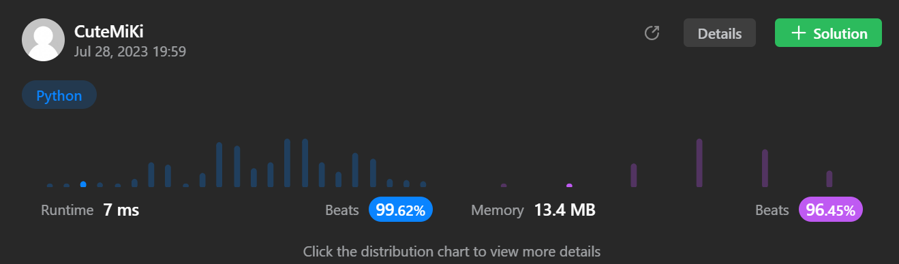

# 92. Reverse Linked List II
### Tag: [Medium](https://github.com/TheOnlyMiki/LeetCode-For-Fun/tree/main#medium-level), [Linked List](https://github.com/TheOnlyMiki/LeetCode-For-Fun/tree/main#linked-list)
---
<div class="px-5 pt-4"><div class="flex"></div><div class="_1l1MA" data-track-load="description_content"><p>Given the <code>head</code> of a singly linked list and two integers <code>left</code> and <code>right</code> where <code>left &lt;= right</code>, reverse the nodes of the list from position <code>left</code> to position <code>right</code>, and return <em>the reversed list</em>.</p>

<p>&nbsp;</p>
<p><strong class="example">Example 1:</strong></p>

<pre><strong>Input:</strong> head = [1,2,3,4,5], left = 2, right = 4
<strong>Output:</strong> [1,4,3,2,5]
</pre>

<p><strong class="example">Example 2:</strong></p>

<pre><strong>Input:</strong> head = [5], left = 1, right = 1
<strong>Output:</strong> [5]
</pre>

<p>&nbsp;</p>
<p><strong>Constraints:</strong></p>

<ul>
	<li>The number of nodes in the list is <code>n</code>.</li>
	<li><code>1 &lt;= n &lt;= 500</code></li>
	<li><code>-500 &lt;= Node.val &lt;= 500</code></li>
	<li><code>1 &lt;= left &lt;= right &lt;= n</code></li>
</ul>

<p>&nbsp;</p>
<strong>Follow up:</strong> Could you do it in one pass?</div></div>

---


### Solution

```python
# Definition for singly-linked list.
# class ListNode(object):
#     def __init__(self, val=0, next=None):
#         self.val = val
#         self.next = next
class Solution(object):
    def reverseOperation(self, record, end):
        start = record.next
        record.next = end
        return start, record

    def reverseBetween(self, head, left, right):
        """
        :type head: ListNode
        :type left: int
        :type right: int
        :rtype: ListNode
        """
        i = 1
        record = head
        # 1 -> 2 -> 3, let's say we at 2
        # start for recording the address of 3
        # end for recording the address 2 itself
        start = None
        end = None
        # left node for the address of last node before reverse
        # right node for the address of last node after reverse
        # 1 -> 2 -> 3 -> 4, let's say we reverse 3 -> 2
        # left node will be node 1, and right node should continues 
        # to the next node of 2, which is 1 -> 3...; 2 -> 4....
        left_node = None
        right_node = None

        while i <= right:
            if i >= left:
                # Reverse the node
                record, end = self.reverseOperation(record, end)
            else:
                left_node = record
                record = record.next
            
            i += 1
        
        # If there is left node need to be insert, then right node should be
        # the next node to continues the remain nodes, since below:
        # 1 -> 2 -> 3 -> 4, let's say we reverse 3 -> 2
        # left node will be node 1, and right node should continues 
        # to the next node of 2, which is 1 -> 3...; 2 -> 4....
        right_node = (left_node.next if left_node else head)
        right_node.next = record
        if left_node:
            left_node.next = end
            end = head
        
        return end

        # Reverse 
        """
        record = head
        start = None
        end = None

        while record:
            start = record.next
            record.next = end
            end = record

            record = start

        return end
        """
```
