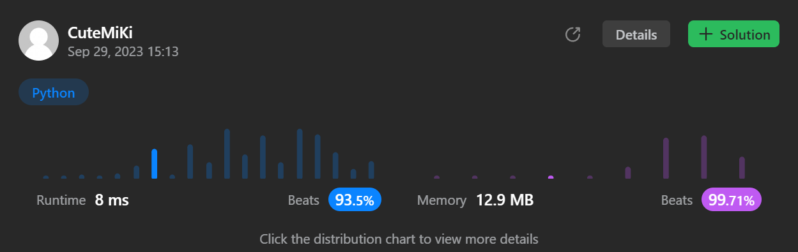

# 94. Binary Tree Inorder Traversal
### Tag: [Easy](https://github.com/TheOnlyMiki/LeetCode-For-Fun/tree/main#easy-level), [Stack](https://github.com/TheOnlyMiki/LeetCode-For-Fun/tree/main#stack), [Depth-First Search](https://github.com/TheOnlyMiki/LeetCode-For-Fun/tree/main#depth-first-search), [Binary Tree](https://github.com/TheOnlyMiki/LeetCode-For-Fun/tree/main#binary-tree)
---
<div class="px-5 pt-4"><div class="flex"></div><div class="xFUwe" data-track-load="description_content"><p>Given the <code>root</code> of a binary tree, return <em>the inorder traversal of its nodes' values</em>.</p>

<p>&nbsp;</p>
<p><strong class="example">Example 1:</strong></p>

<pre><strong>Input:</strong> root = [1,null,2,3]
<strong>Output:</strong> [1,3,2]
</pre>

<p><strong class="example">Example 2:</strong></p>

<pre><strong>Input:</strong> root = []
<strong>Output:</strong> []
</pre>

<p><strong class="example">Example 3:</strong></p>

<pre><strong>Input:</strong> root = [1]
<strong>Output:</strong> [1]
</pre>

<p>&nbsp;</p>
<p><strong>Constraints:</strong></p>

<ul>
	<li>The number of nodes in the tree is in the range <code>[0, 100]</code>.</li>
	<li><code>-100 &lt;= Node.val &lt;= 100</code></li>
</ul>

<p>&nbsp;</p>
<strong>Follow up:</strong> Recursive solution is trivial, could you do it iteratively?</div></div>

---


### Solution

```python
# Definition for a binary tree node.
# class TreeNode(object):
#     def __init__(self, val=0, left=None, right=None):
#         self.val = val
#         self.left = left
#         self.right = right
class Solution(object):
    def inorderTraversal(self, root):
        """
        :type root: TreeNode
        :rtype: List[int]
        """
        self.output = []
        def dfs(node):
            if node:
                if node.left:
                    dfs(node.left)
                self.output.append(node.val)
                if node.right:
                    dfs(node.right)
        
        dfs(root)
        return self.output
```
