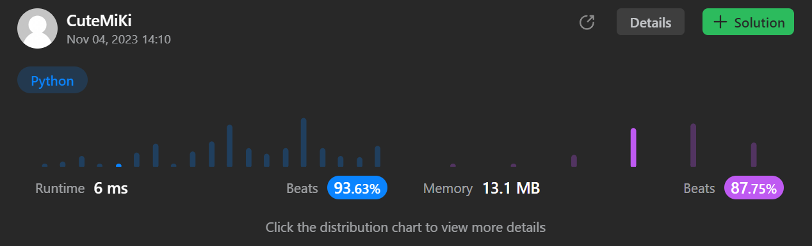

# 96. Unique Binary Search Trees
### Tag: [Medium](https://github.com/TheOnlyMiki/LeetCode-For-Fun/tree/main#medium-level), [Math](https://github.com/TheOnlyMiki/LeetCode-For-Fun/tree/main#math), [Dynamic Programming](https://github.com/TheOnlyMiki/LeetCode-For-Fun/tree/main#dynamic-programming), [Binary Tree](https://github.com/TheOnlyMiki/LeetCode-For-Fun/tree/main#binary-tree)
---
<div class="px-5 pt-4"><div class="flex"></div><div class="xFUwe" data-track-load="description_content"><p>Given an integer <code>n</code>, return <em>the number of structurally unique <strong>BST'</strong>s (binary search trees) which has exactly </em><code>n</code><em> nodes of unique values from</em> <code>1</code> <em>to</em> <code>n</code>.</p>

<p>&nbsp;</p>
<p><strong class="example">Example 1:</strong></p>

<pre><strong>Input:</strong> n = 3
<strong>Output:</strong> 5
</pre>

<p><strong class="example">Example 2:</strong></p>

<pre><strong>Input:</strong> n = 1
<strong>Output:</strong> 1
</pre>

<p>&nbsp;</p>
<p><strong>Constraints:</strong></p>

<ul>
	<li><code>1 &lt;= n &lt;= 19</code></li>
</ul>
</div></div>

---


### Solution

```python
class Solution(object):
    def numTrees(self, n):
        """
        :type n: int
        :rtype: int
        """
        # Option 2 - Dynamic Programming
        record = [0] * (n+1)
        record[0] = 1
        for i in range(1, n+1):
            for j in range(i):
                record[i] += record[j] * record[i-j-1]

        return record[n]

        # Option 1 - DFS
        """
        record = {0:1}

        def dfs(n):
            if n in record:
                return record[n]

            total = 0
            for i in range(n):
                total += dfs(i) * dfs(n-i-1)

            record[n] = total
            return total 

        return dfs(n)
        """
```
