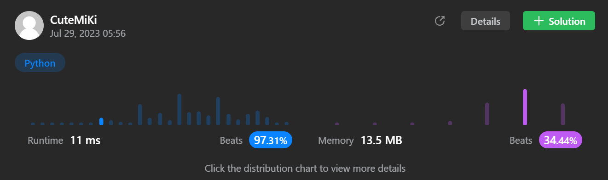

# 101. Symmetric Tree
### Tag: [Easy](https://github.com/TheOnlyMiki/LeetCode-For-Fun/tree/main#easy-level), [Depth-First Search](https://github.com/TheOnlyMiki/LeetCode-For-Fun/tree/main#depth-first-search), [Breadth-First Search](https://github.com/TheOnlyMiki/LeetCode-For-Fun/tree/main#breadth-first-search), [Binary Tree](https://github.com/TheOnlyMiki/LeetCode-For-Fun/tree/main#binary-tree)
---
<div class="px-5 pt-4"><div class="flex"></div><div class="_1l1MA" data-track-load="description_content"><p>Given the <code>root</code> of a binary tree, <em>check whether it is a mirror of itself</em> (i.e., symmetric around its center).</p>

<p>&nbsp;</p>
<p><strong class="example">Example 1:</strong></p>

<pre><strong>Input:</strong> root = [1,2,2,3,4,4,3]
<strong>Output:</strong> true
</pre>

<p><strong class="example">Example 2:</strong></p>

<pre><strong>Input:</strong> root = [1,2,2,null,3,null,3]
<strong>Output:</strong> false
</pre>

<p>&nbsp;</p>
<p><strong>Constraints:</strong></p>

<ul>
	<li>The number of nodes in the tree is in the range <code>[1, 1000]</code>.</li>
	<li><code>-100 &lt;= Node.val &lt;= 100</code></li>
</ul>

<p>&nbsp;</p>
<strong>Follow up:</strong> Could you solve it both recursively and iteratively?</div></div>

---


### Solution

```python
# Definition for a binary tree node.
# class TreeNode(object):
#     def __init__(self, val=0, left=None, right=None):
#         self.val = val
#         self.left = left
#         self.right = right
class Solution(object):
    def isSymmetric(self, root):
        """
        :type root: TreeNode
        :rtype: bool
        """
        def checkSymmetric(left, right):
            if left and right:
                if left.val == right.val:
                    return checkSymmetric(left.left, right.right) and checkSymmetric(left.right, right.left)
                else:
                    return False
            elif left:
                return False
            elif right:
                return False
            return True
            
        # Option 1
        """
        def checkSymmetric(left, right):
            if not left and not right:
                return True
            elif not left or not right:
                return False
            elif left.val != right.val:
                return False
            return checkSymmetric(left.left, right.right) and checkSymmetric(left.right, right.left)
            """

        return checkSymmetric(root.left, root.right)
```
