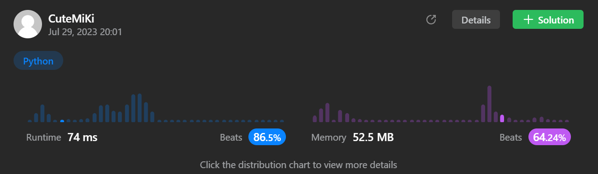

# 105. Construct Binary Tree from Preorder and Inorder Traversal
### Tag: [Medium](https://github.com/TheOnlyMiki/LeetCode-For-Fun/tree/main#medium-level), [Array](https://github.com/TheOnlyMiki/LeetCode-For-Fun/tree/main#array), [Hash Table](https://github.com/TheOnlyMiki/LeetCode-For-Fun/tree/main#hash-table), [Divide and Conquer](https://github.com/TheOnlyMiki/LeetCode-For-Fun/tree/main#divide-and-conquer), [Binary Tree](https://github.com/TheOnlyMiki/LeetCode-For-Fun/tree/main#binary-tree)
---
<div class="px-5 pt-4"><div class="flex"></div><div class="_1l1MA" data-track-load="description_content"><p>Given two integer arrays <code>preorder</code> and <code>inorder</code> where <code>preorder</code> is the preorder traversal of a binary tree and <code>inorder</code> is the inorder traversal of the same tree, construct and return <em>the binary tree</em>.</p>

<p>&nbsp;</p>
<p><strong class="example">Example 1:</strong></p>

<pre><strong>Input:</strong> preorder = [3,9,20,15,7], inorder = [9,3,15,20,7]
<strong>Output:</strong> [3,9,20,null,null,15,7]
</pre>

<p><strong class="example">Example 2:</strong></p>

<pre><strong>Input:</strong> preorder = [-1], inorder = [-1]
<strong>Output:</strong> [-1]
</pre>

<p>&nbsp;</p>
<p><strong>Constraints:</strong></p>

<ul>
	<li><code>1 &lt;= preorder.length &lt;= 3000</code></li>
	<li><code>inorder.length == preorder.length</code></li>
	<li><code>-3000 &lt;= preorder[i], inorder[i] &lt;= 3000</code></li>
	<li><code>preorder</code> and <code>inorder</code> consist of <strong>unique</strong> values.</li>
	<li>Each value of <code>inorder</code> also appears in <code>preorder</code>.</li>
	<li><code>preorder</code> is <strong>guaranteed</strong> to be the preorder traversal of the tree.</li>
	<li><code>inorder</code> is <strong>guaranteed</strong> to be the inorder traversal of the tree.</li>
</ul>
</div></div>

---


### Solution

```python
# Definition for a binary tree node.
# class TreeNode(object):
#     def __init__(self, val=0, left=None, right=None):
#         self.val = val
#         self.left = left
#         self.right = right
class Solution(object):
    def buildTree(self, preorder, inorder):
        """
        :type preorder: List[int]
        :type inorder: List[int]
        :rtype: TreeNode
        """

        def getTree(preorder, inorder, length):
            root = inorder.index(preorder[0])
            node = TreeNode(preorder[0])
            if root != 0:
                node.left = getTree(preorder[1:length], inorder, root)
            if root != length - 1:
                node.right = getTree(preorder[root+1:length], inorder[root+1:length], length - root - 1)
            return node

        return getTree(preorder, inorder, len(preorder))
```
