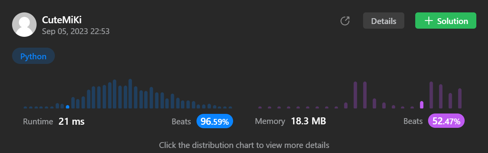

# 110. Balanced Binary Tree
### Tag: [Easy](https://github.com/TheOnlyMiki/LeetCode-For-Fun/tree/main#easy-level), [Depth-First Search](https://github.com/TheOnlyMiki/LeetCode-For-Fun/tree/main#depth-first-search), [Binary Tree](https://github.com/TheOnlyMiki/LeetCode-For-Fun/tree/main#binary-tree)
---
<div class="px-5 pt-4"><div class="flex"></div><div class="xFUwe" data-track-load="description_content"><p>Given a binary tree, determine if it is <span data-keyword="height-balanced" class=" cursor-pointer relative text-dark-blue-s text-sm"><div class="popover-wrapper inline-block" data-headlessui-state=""><div><div aria-expanded="false" data-headlessui-state="" id="headlessui-popover-button-:rp:"><div><strong>height-balanced</strong></div></div><div style="position: fixed; z-index: 40; inset: 0px auto auto 0px; transform: translate(308px, 221px);"></div></div></div></span>.</p>

<p>&nbsp;</p>
<p><strong class="example">Example 1:</strong></p>

<pre><strong>Input:</strong> root = [3,9,20,null,null,15,7]
<strong>Output:</strong> true
</pre>

<p><strong class="example">Example 2:</strong></p>

<pre><strong>Input:</strong> root = [1,2,2,3,3,null,null,4,4]
<strong>Output:</strong> false
</pre>

<p><strong class="example">Example 3:</strong></p>

<pre><strong>Input:</strong> root = []
<strong>Output:</strong> true
</pre>

<p>&nbsp;</p>
<p><strong>Constraints:</strong></p>

<ul>
	<li>The number of nodes in the tree is in the range <code>[0, 5000]</code>.</li>
	<li><code>-10<sup>4</sup> &lt;= Node.val &lt;= 10<sup>4</sup></code></li>
</ul>
</div></div>

---


### Solution

```python
# Definition for a binary tree node.
# class TreeNode(object):
#     def __init__(self, val=0, left=None, right=None):
#         self.val = val
#         self.left = left
#         self.right = right
class Solution(object):
    def isBalanced(self, root):
        """
        :type root: TreeNode
        :rtype: bool
        """
        def checkDepth(node):
            if node:
                left_depth = checkDepth(node.left)
                if left_depth == -1:
                    return -1
                right_depth = checkDepth(node.right)
                if right_depth == -1:
                    return -1
                if abs(left_depth - right_depth) > 1:
                    return -1

                return max(left_depth, right_depth) + 1
            
            return 0

        return checkDepth(root) != -1
```
