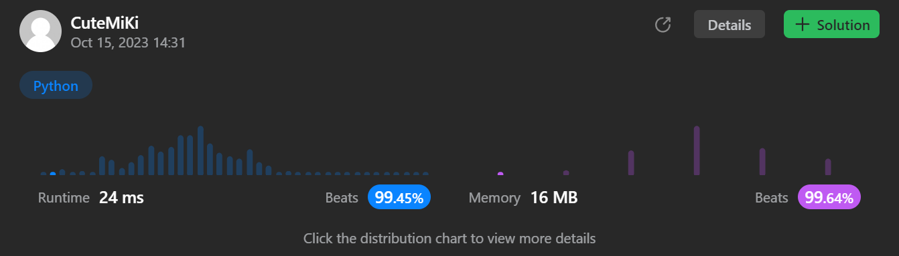

# 116. Populating Next Right Pointers in Each Node
### Tag: [Medium](https://github.com/TheOnlyMiki/LeetCode-For-Fun/tree/main#medium-level), [Linked List](https://github.com/TheOnlyMiki/LeetCode-For-Fun/tree/main#linked-list), [Depth-First Search](https://github.com/TheOnlyMiki/LeetCode-For-Fun/tree/main#depth-first-search), [Breadth-First Search](https://github.com/TheOnlyMiki/LeetCode-For-Fun/tree/main#breadth-first-search), [Binary Tree](https://github.com/TheOnlyMiki/LeetCode-For-Fun/tree/main#binary-tree)
---
<div class="px-5 pt-4"><div class="flex"></div><div class="xFUwe" data-track-load="description_content"><p>You are given a <strong>perfect binary tree</strong> where all leaves are on the same level, and every parent has two children. The binary tree has the following definition:</p>

<pre>struct Node {
  int val;
  Node *left;
  Node *right;
  Node *next;
}
</pre>

<p>Populate each next pointer to point to its next right node. If there is no next right node, the next pointer should be set to <code>NULL</code>.</p>

<p>Initially, all next pointers are set to <code>NULL</code>.</p>

<p>&nbsp;</p>
<p><strong class="example">Example 1:</strong></p>

<pre><strong>Input:</strong> root = [1,2,3,4,5,6,7]
<strong>Output:</strong> [1,#,2,3,#,4,5,6,7,#]
<strong>Explanation: </strong>Given the above perfect binary tree (Figure A), your function should populate each next pointer to point to its next right node, just like in Figure B. The serialized output is in level order as connected by the next pointers, with '#' signifying the end of each level.
</pre>

<p><strong class="example">Example 2:</strong></p>

<pre><strong>Input:</strong> root = []
<strong>Output:</strong> []
</pre>

<p>&nbsp;</p>
<p><strong>Constraints:</strong></p>

<ul>
	<li>The number of nodes in the tree is in the range <code>[0, 2<sup>12</sup> - 1]</code>.</li>
	<li><code>-1000 &lt;= Node.val &lt;= 1000</code></li>
</ul>

<p>&nbsp;</p>
<p><strong>Follow-up:</strong></p>

<ul>
	<li>You may only use constant extra space.</li>
	<li>The recursive approach is fine. You may assume implicit stack space does not count as extra space for this problem.</li>
</ul>
</div></div>

---


### Solution

```python
"""
# Definition for a Node.
class Node(object):
    def __init__(self, val=0, left=None, right=None, next=None):
        self.val = val
        self.left = left
        self.right = right
        self.next = next
"""

class Solution(object):
    def connect(self, root):
        """
        :type root: Node
        :rtype: Node
        """
        if not root:
            return None

        nodes = [root]

        while nodes:
            next_level = []
            pre_node = None

            for node in nodes:
                if pre_node:
                    pre_node.next = node
                pre_node = node

                if node.left:
                    next_level.append(node.left)

                if node.right:
                    next_level.append(node.right)
            
            nodes = next_level

        return root
```
