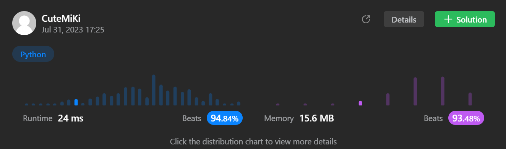

# 117. Populating Next Right Pointers in Each Node II
### Tag: [Medium](https://github.com/TheOnlyMiki/LeetCode-For-Fun/tree/main#medium-level), [Linked List](https://github.com/TheOnlyMiki/LeetCode-For-Fun/tree/main#linked-list), [Depth-First Search](https://github.com/TheOnlyMiki/LeetCode-For-Fun/tree/main#depth-first-search), [Breadth-First Search](https://github.com/TheOnlyMiki/LeetCode-For-Fun/tree/main#breadth-first-search), [Binary Tree](https://github.com/TheOnlyMiki/LeetCode-For-Fun/tree/main#binary-tree)
---
<div class="px-5 pt-4"><div class="flex"></div><div class="_1l1MA" data-track-load="description_content"><p>Given a binary tree</p>

<pre>struct Node {
  int val;
  Node *left;
  Node *right;
  Node *next;
}
</pre>

<p>Populate each next pointer to point to its next right node. If there is no next right node, the next pointer should be set to <code>NULL</code>.</p>

<p>Initially, all next pointers are set to <code>NULL</code>.</p>

<p>&nbsp;</p>
<p><strong class="example">Example 1:</strong></p>

<pre><strong>Input:</strong> root = [1,2,3,4,5,null,7]
<strong>Output:</strong> [1,#,2,3,#,4,5,7,#]
<strong>Explanation: </strong>Given the above binary tree (Figure A), your function should populate each next pointer to point to its next right node, just like in Figure B. The serialized output is in level order as connected by the next pointers, with '#' signifying the end of each level.
</pre>

<p><strong class="example">Example 2:</strong></p>

<pre><strong>Input:</strong> root = []
<strong>Output:</strong> []
</pre>

<p>&nbsp;</p>
<p><strong>Constraints:</strong></p>

<ul>
	<li>The number of nodes in the tree is in the range <code>[0, 6000]</code>.</li>
	<li><code>-100 &lt;= Node.val &lt;= 100</code></li>
</ul>

<p>&nbsp;</p>
<p><strong>Follow-up:</strong></p>

<ul>
	<li>You may only use constant extra space.</li>
	<li>The recursive approach is fine. You may assume implicit stack space does not count as extra space for this problem.</li>
</ul>
</div></div>

---


### Solution

```python
"""
# Definition for a Node.
class Node(object):
    def __init__(self, val=0, left=None, right=None, next=None):
        self.val = val
        self.left = left
        self.right = right
        self.next = next
"""

class Solution(object):
    def connect(self, root):
        """
        :type root: Node
        :rtype: Node
        """

        if not root:
            return None

        nodes = [root]
        next_level = None
        pre_node = None

        while nodes:
            next_level = []
            pre_node = None

            for node in nodes:
                if node.left:
                    next_level.append(node.left)
                    # Option 2 - Do it in place
                    if pre_node:
                        pre_node.next = node.left
                    pre_node = node.left

                if node.right:
                    next_level.append(node.right)
                    # Option 2 - Do it in place
                    if pre_node:
                        pre_node.next = node.right
                    pre_node = node.right

            # Option 1 - after storing
            """
            for i in range(len(next_level) - 1):
                next_level[i].next = next_level[i + 1]
            """
            
            nodes = next_level

        return root
```
