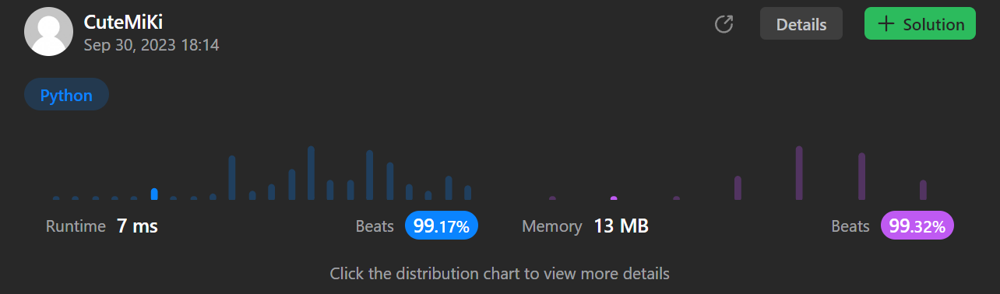

# 118. Pascal's Triangle
### Tag: [Easy](https://github.com/TheOnlyMiki/LeetCode-For-Fun/tree/main#easy-level), [Array](https://github.com/TheOnlyMiki/LeetCode-For-Fun/tree/main#array), [Dynamic Programming](https://github.com/TheOnlyMiki/LeetCode-For-Fun/tree/main#dynamic-programming)
---
<div class="px-5 pt-4"><div class="flex"></div><div class="xFUwe" data-track-load="description_content"><p>Given an integer <code>numRows</code>, return the first numRows of <strong>Pascal's triangle</strong>.</p>

<p>In <strong>Pascal's triangle</strong>, each number is the sum of the two numbers directly above it as shown:</p>

<p>&nbsp;</p>
<p><strong class="example">Example 1:</strong></p>
<pre><strong>Input:</strong> numRows = 5
<strong>Output:</strong> [[1],[1,1],[1,2,1],[1,3,3,1],[1,4,6,4,1]]
</pre><p><strong class="example">Example 2:</strong></p>
<pre><strong>Input:</strong> numRows = 1
<strong>Output:</strong> [[1]]
</pre>
<p>&nbsp;</p>
<p><strong>Constraints:</strong></p>

<ul>
	<li><code>1 &lt;= numRows &lt;= 30</code></li>
</ul>
</div></div>

---


### Solution

```python
class Solution(object):
    def generate(self, numRows):
        """
        :type numRows: int
        :rtype: List[List[int]]
        """
        previou = None
        output = [[1]]
        for i in range(1, numRows):
            output.append([1])
            for index in range(i-1):
                output[i].append(previou[index] + previou[index+1])
            output[i].append(1)
            previou = output[i]
            
        return output
```
