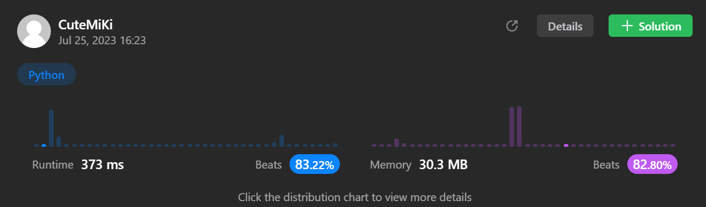

# 128. Longest Consecutive Sequence
### Tag: [Medium](https://github.com/TheOnlyMiki/LeetCode-For-Fun/tree/main#medium-level), [Array](https://github.com/TheOnlyMiki/LeetCode-For-Fun/tree/main#array), [Hash Table](https://github.com/TheOnlyMiki/LeetCode-For-Fun/tree/main#hash-table), [Union Find](https://github.com/TheOnlyMiki/LeetCode-For-Fun/tree/main#union-find)
---
<div class="px-5 pt-4"><div class="flex"></div><div class="_1l1MA" data-track-load="description_content"><p>Given an unsorted array of integers <code>nums</code>, return <em>the length of the longest consecutive elements sequence.</em></p>

<p>You must write an algorithm that runs in&nbsp;<code>O(n)</code>&nbsp;time.</p>

<p>&nbsp;</p>
<p><strong class="example">Example 1:</strong></p>

<pre><strong>Input:</strong> nums = [100,4,200,1,3,2]
<strong>Output:</strong> 4
<strong>Explanation:</strong> The longest consecutive elements sequence is <code>[1, 2, 3, 4]</code>. Therefore its length is 4.
</pre>

<p><strong class="example">Example 2:</strong></p>

<pre><strong>Input:</strong> nums = [0,3,7,2,5,8,4,6,0,1]
<strong>Output:</strong> 9
</pre>

<p>&nbsp;</p>
<p><strong>Constraints:</strong></p>

<ul>
	<li><code>0 &lt;= nums.length &lt;= 10<sup>5</sup></code></li>
	<li><code>-10<sup>9</sup> &lt;= nums[i] &lt;= 10<sup>9</sup></code></li>
</ul>
</div></div>

---


### Solution

```python
class Solution(object):
    # Option 2 - Same but less code and space O(n)
    def longestConsecutive(self, nums):
        """
        :type nums: List[int]
        :rtype: int
        """
        nums = set(nums)
        output = 0

        for num in nums:
            if num - 1 not in nums:
                max_num = num + 1
                while max_num in nums:
                    max_num += 1
                output = max(output, max_num - num)

        return output

    # Option 1 - Time O(n) and Space O(n + n)
    '''
    def countContinue(self, nums, check, direction):
        if check in nums:
            self.record.add(check)
            return self.countContinue(nums, check + direction, direction) + 1
        else:
            return 0

    def longestConsecutive(self, nums):
        """
        :type nums: List[int]
        :rtype: int
        """
        self.record = set()
        nums = set(nums)
        output = 0

        for num in nums:
            if num not in self.record:
                self.record.add(num)
                output = max(output, self.countContinue(nums, num-1, -1) + 1 + self.countContinue(nums, num+1, 1))

        return output
        '''
```
