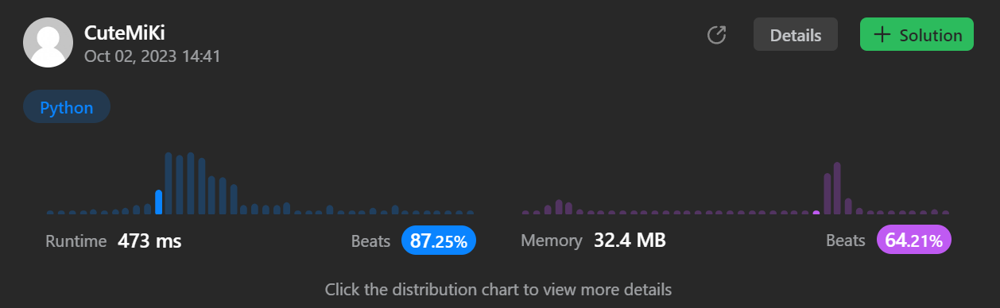

# 131. Palindrome Partitioning
### Tag: [Medium](https://github.com/TheOnlyMiki/LeetCode-For-Fun/tree/main#medium-level), [String](https://github.com/TheOnlyMiki/LeetCode-For-Fun/tree/main#string), [Dynamic Programming](https://github.com/TheOnlyMiki/LeetCode-For-Fun/tree/main#dynamic-programming), [Backtracking](https://github.com/TheOnlyMiki/LeetCode-For-Fun/tree/main#backtracking)
---
<div class="px-5 pt-4"><div class="flex"></div><div class="xFUwe" data-track-load="description_content"><p>Given a string <code>s</code>, partition <code>s</code> such that every <span data-keyword="substring-nonempty" class=" cursor-pointer relative text-dark-blue-s text-sm"><div class="popover-wrapper inline-block" data-headlessui-state=""><div><div aria-expanded="false" data-headlessui-state="" id="headlessui-popover-button-:ro:"><div>substring</div></div><div style="position: fixed; z-index: 40; inset: 0px auto auto 0px; transform: translate(334px, 221px);"></div></div></div></span> of the partition is a <span data-keyword="palindrome-string" class=" cursor-pointer relative text-dark-blue-s text-sm"><div class="popover-wrapper inline-block" data-headlessui-state=""><div><div aria-expanded="false" data-headlessui-state="" id="headlessui-popover-button-:rq:"><div><strong>palindrome</strong></div></div><div style="position: fixed; z-index: 40; inset: 0px auto auto 0px; transform: translate(187px, 242px);"></div></div></div></span>. Return <em>all possible palindrome partitioning of </em><code>s</code>.</p>

<p>&nbsp;</p>
<p><strong class="example">Example 1:</strong></p>
<pre><strong>Input:</strong> s = "aab"
<strong>Output:</strong> [["a","a","b"],["aa","b"]]
</pre><p><strong class="example">Example 2:</strong></p>
<pre><strong>Input:</strong> s = "a"
<strong>Output:</strong> [["a"]]
</pre>
<p>&nbsp;</p>
<p><strong>Constraints:</strong></p>

<ul>
	<li><code>1 &lt;= s.length &lt;= 16</code></li>
	<li><code>s</code> contains only lowercase English letters.</li>
</ul>
</div></div>

---


### Solution

```python
class Solution(object):
    def partition(self, s):
        """
        :type s: str
        :rtype: List[List[str]]
        """
        def checkPalindrome(word):
            if word in record:
                return record[word]

            left, right = 0, len(word)-1
            while left < right:
                if word[left] != word[right]:
                    record[word] = False
                    return False
                left, right = left+1, right-1

            record[word] = True
            return True

        def getOutput(store, word):
            if len(word) == 0:
                output.append(store[:])
                return

            for i in range(1, len(word)+1):
                if checkPalindrome(word[:i]):
                    getOutput(store + [word[:i]], word[i:])
        output = []
        record = {}
        getOutput([], s)
        return output
```
