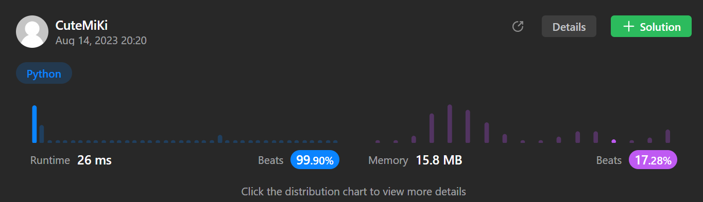

# 137. Single Number II
### Tag: [Medium](https://github.com/TheOnlyMiki/LeetCode-For-Fun/tree/main#medium-level), [Array](https://github.com/TheOnlyMiki/LeetCode-For-Fun/tree/main#array), [Bit Manipulation](https://github.com/TheOnlyMiki/LeetCode-For-Fun/tree/main#bit-manipulation)
---
<div class="px-5 pt-4"><div class="flex"></div><div class="xFUwe" data-track-load="description_content"><p>Given an integer array <code>nums</code> where&nbsp;every element appears <strong>three times</strong> except for one, which appears <strong>exactly once</strong>. <em>Find the single element and return it</em>.</p>

<p>You must&nbsp;implement a solution with a linear runtime complexity and use&nbsp;only constant&nbsp;extra space.</p>

<p>&nbsp;</p>
<p><strong class="example">Example 1:</strong></p>
<pre><strong>Input:</strong> nums = [2,2,3,2]
<strong>Output:</strong> 3
</pre><p><strong class="example">Example 2:</strong></p>
<pre><strong>Input:</strong> nums = [0,1,0,1,0,1,99]
<strong>Output:</strong> 99
</pre>
<p>&nbsp;</p>
<p><strong>Constraints:</strong></p>

<ul>
	<li><code>1 &lt;= nums.length &lt;= 3 * 10<sup>4</sup></code></li>
	<li><code>-2<sup>31</sup> &lt;= nums[i] &lt;= 2<sup>31</sup> - 1</code></li>
	<li>Each element in <code>nums</code> appears exactly <strong>three times</strong> except for one element which appears <strong>once</strong>.</li>
</ul>
</div></div>

---


### Solution

```python
class Solution(object):
    def singleNumber(self, nums):
        """
        :type nums: List[int]
        :rtype: int
        """
        # Option 2 - Bit operation but some math
        output = 0
        consum = None
        for i in xrange(32):
            consum = 0
            for num in nums:
                if num < 0:
                    num = num & (2**32-1)
                consum += num >> i & 1
            if consum % 3 == 1:
                output += 2**i

        return output - 2**32 if output >= 2**31 else output

        # Option 1 - Time O(n) Space O(n)
        record1 = set()
        record2 = set()
        for num in nums:
            if num in record1:
                if num in record2:
                    record1.remove(num)
                else:
                    record2.add(num)
            else:
                record1.add(num)

        return record1.pop()
```
