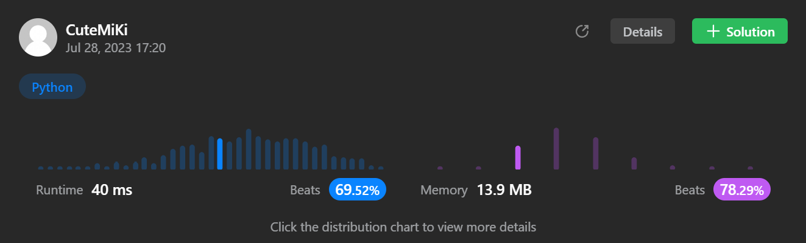

# 138. Copy List with Random Pointer
### Tag: [Medium](https://github.com/TheOnlyMiki/LeetCode-For-Fun/tree/main#medium-level), [Hash Table](https://github.com/TheOnlyMiki/LeetCode-For-Fun/tree/main#hash-table), [Linked List](https://github.com/TheOnlyMiki/LeetCode-For-Fun/tree/main#linked-list)
---
<div class="px-5 pt-4"><div class="flex"></div><div class="_1l1MA" data-track-load="description_content"><p>A linked list of length <code>n</code> is given such that each node contains an additional random pointer, which could point to any node in the list, or <code>null</code>.</p>

<p>Construct a <a href="https://en.wikipedia.org/wiki/Object_copying#Deep_copy" target="_blank"><strong>deep copy</strong></a> of the list. The deep copy should consist of exactly <code>n</code> <strong>brand new</strong> nodes, where each new node has its value set to the value of its corresponding original node. Both the <code>next</code> and <code>random</code> pointer of the new nodes should point to new nodes in the copied list such that the pointers in the original list and copied list represent the same list state. <strong>None of the pointers in the new list should point to nodes in the original list</strong>.</p>

<p>For example, if there are two nodes <code>X</code> and <code>Y</code> in the original list, where <code>X.random --&gt; Y</code>, then for the corresponding two nodes <code>x</code> and <code>y</code> in the copied list, <code>x.random --&gt; y</code>.</p>

<p>Return <em>the head of the copied linked list</em>.</p>

<p>The linked list is represented in the input/output as a list of <code>n</code> nodes. Each node is represented as a pair of <code>[val, random_index]</code> where:</p>

<ul>
	<li><code>val</code>: an integer representing <code>Node.val</code></li>
	<li><code>random_index</code>: the index of the node (range from <code>0</code> to <code>n-1</code>) that the <code>random</code> pointer points to, or <code>null</code> if it does not point to any node.</li>
</ul>

<p>Your code will <strong>only</strong> be given the <code>head</code> of the original linked list.</p>

<p>&nbsp;</p>
<p><strong class="example">Example 1:</strong></p>

<pre><strong>Input:</strong> head = [[7,null],[13,0],[11,4],[10,2],[1,0]]
<strong>Output:</strong> [[7,null],[13,0],[11,4],[10,2],[1,0]]
</pre>

<p><strong class="example">Example 2:</strong></p>

<pre><strong>Input:</strong> head = [[1,1],[2,1]]
<strong>Output:</strong> [[1,1],[2,1]]
</pre>

<p><strong class="example">Example 3:</strong></p>

<p><strong></strong></p>

<pre><strong>Input:</strong> head = [[3,null],[3,0],[3,null]]
<strong>Output:</strong> [[3,null],[3,0],[3,null]]
</pre>

<p>&nbsp;</p>
<p><strong>Constraints:</strong></p>

<ul>
	<li><code>0 &lt;= n &lt;= 1000</code></li>
	<li><code>-10<sup>4</sup> &lt;= Node.val &lt;= 10<sup>4</sup></code></li>
	<li><code>Node.random</code> is <code>null</code> or is pointing to some node in the linked list.</li>
</ul>
</div></div>

---


### Solution

```python
"""
# Definition for a Node.
class Node:
    def __init__(self, x, next=None, random=None):
        self.val = int(x)
        self.next = next
        self.random = random
"""

class Solution(object):
    def copyRandomList(self, head):
        """
        :type head: Node
        :rtype: Node
        """
        # Option 2 - Use map(hash table) instead list
        nodes = {None:None}
        record = head

        while record:
            nodes[record] = Node(record.val)
            record = record.next

        record = head
        while record:
            nodes[record].next = nodes[record.next]
            nodes[record].random = nodes[record.random]
            record = record.next

        return nodes[head]

        # Option 1 - Use list to store head infos , it was Slow
        """
        # nodes[0] ==> original, nodes[1] ==> copy
        nodes = [[], []]

        length = 0
        record = head
        while record:
            nodes[0].append(record)
            nodes[1].append(Node(record.val))
            record = record.next
            length += 1

        for i in range(length):
            nodes[1][i].next = (None if i+1 == length else nodes[1][i+1])
            if nodes[0][i].random in nodes[0]:
                record = nodes[0].index(nodes[0][i].random)
                nodes[1][i].random = nodes[1][record]
            
        return (nodes[1][0] if length > 0 else None)
        """
```
