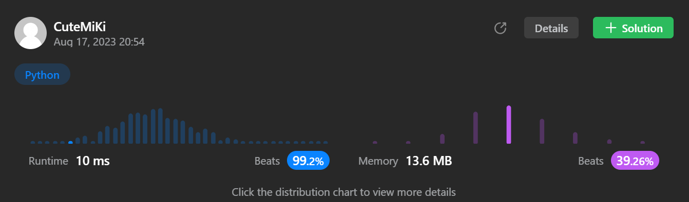

# 139. Word Break
### Tag: [Medium](https://github.com/TheOnlyMiki/LeetCode-For-Fun/tree/main#medium-level), [Array](https://github.com/TheOnlyMiki/LeetCode-For-Fun/tree/main#array), [Hash Table](https://github.com/TheOnlyMiki/LeetCode-For-Fun/tree/main#hash-table), [String](https://github.com/TheOnlyMiki/LeetCode-For-Fun/tree/main#string), [Dynamic Programming](https://github.com/TheOnlyMiki/LeetCode-For-Fun/tree/main#dynamic-programming), [Trie](https://github.com/TheOnlyMiki/LeetCode-For-Fun/tree/main#trie)
---
<div class="px-5 pt-4"><div class="flex"></div><div class="xFUwe" data-track-load="description_content"><p>Given a string <code>s</code> and a dictionary of strings <code>wordDict</code>, return <code>true</code> if <code>s</code> can be segmented into a space-separated sequence of one or more dictionary words.</p>

<p><strong>Note</strong> that the same word in the dictionary may be reused multiple times in the segmentation.</p>

<p>&nbsp;</p>
<p><strong class="example">Example 1:</strong></p>

<pre><strong>Input:</strong> s = "leetcode", wordDict = ["leet","code"]
<strong>Output:</strong> true
<strong>Explanation:</strong> Return true because "leetcode" can be segmented as "leet code".
</pre>

<p><strong class="example">Example 2:</strong></p>

<pre><strong>Input:</strong> s = "applepenapple", wordDict = ["apple","pen"]
<strong>Output:</strong> true
<strong>Explanation:</strong> Return true because "applepenapple" can be segmented as "apple pen apple".
Note that you are allowed to reuse a dictionary word.
</pre>

<p><strong class="example">Example 3:</strong></p>

<pre><strong>Input:</strong> s = "catsandog", wordDict = ["cats","dog","sand","and","cat"]
<strong>Output:</strong> false
</pre>

<p>&nbsp;</p>
<p><strong>Constraints:</strong></p>

<ul>
	<li><code>1 &lt;= s.length &lt;= 300</code></li>
	<li><code>1 &lt;= wordDict.length &lt;= 1000</code></li>
	<li><code>1 &lt;= wordDict[i].length &lt;= 20</code></li>
	<li><code>s</code> and <code>wordDict[i]</code> consist of only lowercase English letters.</li>
	<li>All the strings of <code>wordDict</code> are <strong>unique</strong>.</li>
</ul>
</div></div>

---


### Solution

```python
class Solution(object):
    def wordBreak(self, s, wordDict):
        """
        :type s: str
        :type wordDict: List[str]
        :rtype: bool
        """
        wordDict = set(wordDict)
        word_len = set([len(word) for word in wordDict])
        record = { len(s):True }

        def checkValid(start, end):
            if start in record:
                return record[start]

            if s[start:end] in wordDict:
                for n in word_len:
                    if checkValid(end, end+n):
                        return True
                record[end] = False

            return False
        
        for i in word_len:
            if checkValid(0, i):
                return True

        return False
```
