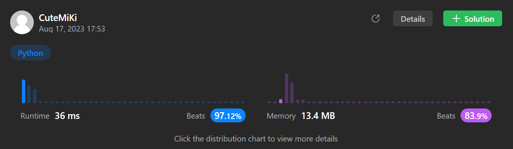

# 149. Max Points on a Line
### Tag: [Hard](https://github.com/TheOnlyMiki/LeetCode-For-Fun/tree/main#hard-level), [Array](https://github.com/TheOnlyMiki/LeetCode-For-Fun/tree/main#array), [Hash Table](https://github.com/TheOnlyMiki/LeetCode-For-Fun/tree/main#hash-table), [Math](https://github.com/TheOnlyMiki/LeetCode-For-Fun/tree/main#math)
---
<div class="px-5 pt-4"><div class="flex"></div><div class="xFUwe" data-track-load="description_content"><p>Given an array of <code>points</code> where <code>points[i] = [x<sub>i</sub>, y<sub>i</sub>]</code> represents a point on the <strong>X-Y</strong> plane, return <em>the maximum number of points that lie on the same straight line</em>.</p>

<p>&nbsp;</p>
<p><strong class="example">Example 1:</strong></p>

<pre><strong>Input:</strong> points = [[1,1],[2,2],[3,3]]
<strong>Output:</strong> 3
</pre>

<p><strong class="example">Example 2:</strong></p>

<pre><strong>Input:</strong> points = [[1,1],[3,2],[5,3],[4,1],[2,3],[1,4]]
<strong>Output:</strong> 4
</pre>

<p>&nbsp;</p>
<p><strong>Constraints:</strong></p>

<ul>
	<li><code>1 &lt;= points.length &lt;= 300</code></li>
	<li><code>points[i].length == 2</code></li>
	<li><code>-10<sup>4</sup> &lt;= x<sub>i</sub>, y<sub>i</sub> &lt;= 10<sup>4</sup></code></li>
	<li>All the <code>points</code> are <strong>unique</strong>.</li>
</ul>
</div></div>

---


### Solution

```python
class Solution(object):
    def maxPoints(self, points):
        """
        :type points: List[List[int]]
        :rtype: int
        """
        length = len(points)
        if length < 3:
            return length

        output = 0
        x2 = y2 = None
        count = slope = None

        for i, (x1, y1) in enumerate(points):
            count = {}
            for index in xrange(i+1, length):
                x2, y2 = points[index]
                slope = None if x1 == x2 else float(y2 - y1) / (x2 - x1)
                count[slope] = count[slope]+1 if slope in count else 2
                output = max(count[slope], output)

        return output
```
