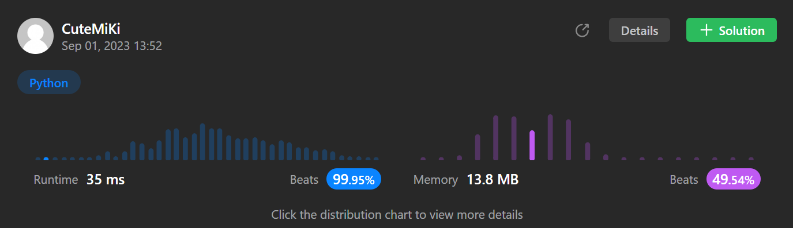

# 152. Maximum Product Subarray
### Tag: [Medium](https://github.com/TheOnlyMiki/LeetCode-For-Fun/tree/main#medium-level), [Array](https://github.com/TheOnlyMiki/LeetCode-For-Fun/tree/main#array), [Dynamic Programming](https://github.com/TheOnlyMiki/LeetCode-For-Fun/tree/main#dynamic-programming)
---
<div class="px-5 pt-4"><div class="flex"></div><div class="xFUwe" data-track-load="description_content"><p>Given an integer array <code>nums</code>, find a <span data-keyword="subarray-nonempty" class=" cursor-pointer relative text-dark-blue-s text-sm"><div class="popover-wrapper inline-block" data-headlessui-state=""><div><div aria-expanded="false" data-headlessui-state="" id="headlessui-popover-button-:rr:"><div>subarray</div></div><div style="position: fixed; z-index: 40; inset: 0px auto auto 0px; transform: translate(274px, 221px);"></div></div></div></span> that has the largest product, and return <em>the product</em>.</p>

<p>The test cases are generated so that the answer will fit in a <strong>32-bit</strong> integer.</p>

<p>&nbsp;</p>
<p><strong class="example">Example 1:</strong></p>

<pre><strong>Input:</strong> nums = [2,3,-2,4]
<strong>Output:</strong> 6
<strong>Explanation:</strong> [2,3] has the largest product 6.
</pre>

<p><strong class="example">Example 2:</strong></p>

<pre><strong>Input:</strong> nums = [-2,0,-1]
<strong>Output:</strong> 0
<strong>Explanation:</strong> The result cannot be 2, because [-2,-1] is not a subarray.
</pre>

<p>&nbsp;</p>
<p><strong>Constraints:</strong></p>

<ul>
	<li><code>1 &lt;= nums.length &lt;= 2 * 10<sup>4</sup></code></li>
	<li><code>-10 &lt;= nums[i] &lt;= 10</code></li>
	<li>The product of any prefix or suffix of <code>nums</code> is <strong>guaranteed</strong> to fit in a <strong>32-bit</strong> integer.</li>
</ul>
</div></div>

---


### Solution

```python
class Solution(object):
    def maxProduct(self, nums):
        """
        :type nums: List[int]
        :rtype: int
        """
        output = num = cur_min = cur_max = nums[0]

        for i in range(1, len(nums)):
            num = nums[i]
            
            cur_min, cur_max = (num * cur_max, num * cur_min) if num < 0 else (num * cur_min, num * cur_max)
            if cur_max < num:
                cur_max = num
            if cur_min > num:
                cur_min = num
            if output < cur_max:
                output = cur_max

        return output
```
