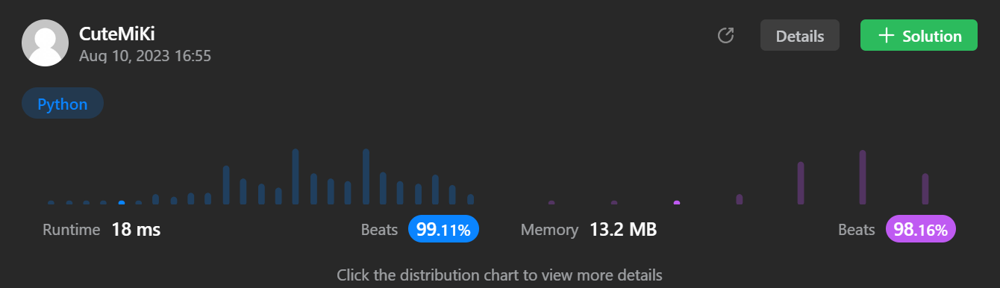

# 162. Find Peak Element
### Tag: [Medium](https://github.com/TheOnlyMiki/LeetCode-For-Fun/tree/main#medium-level), [Array](https://github.com/TheOnlyMiki/LeetCode-For-Fun/tree/main#array), [Binary Search](https://github.com/TheOnlyMiki/LeetCode-For-Fun/tree/main#binary-search)
---
<div class="px-5 pt-4"><div class="flex"></div><div class="xFUwe" data-track-load="description_content"><p>A peak element is an element that is strictly greater than its neighbors.</p>

<p>Given a <strong>0-indexed</strong> integer array <code>nums</code>, find a peak element, and return its index. If the array contains multiple peaks, return the index to <strong>any of the peaks</strong>.</p>

<p>You may imagine that <code>nums[-1] = nums[n] = -∞</code>. In other words, an element is always considered to be strictly greater than a neighbor that is outside the array.</p>

<p>You must write an algorithm that runs in <code>O(log n)</code> time.</p>

<p>&nbsp;</p>
<p><strong class="example">Example 1:</strong></p>

<pre><strong>Input:</strong> nums = [1,2,3,1]
<strong>Output:</strong> 2
<strong>Explanation:</strong> 3 is a peak element and your function should return the index number 2.</pre>

<p><strong class="example">Example 2:</strong></p>

<pre><strong>Input:</strong> nums = [1,2,1,3,5,6,4]
<strong>Output:</strong> 5
<strong>Explanation:</strong> Your function can return either index number 1 where the peak element is 2, or index number 5 where the peak element is 6.</pre>

<p>&nbsp;</p>
<p><strong>Constraints:</strong></p>

<ul>
	<li><code>1 &lt;= nums.length &lt;= 1000</code></li>
	<li><code>-2<sup>31</sup> &lt;= nums[i] &lt;= 2<sup>31</sup> - 1</code></li>
	<li><code>nums[i] != nums[i + 1]</code> for all valid <code>i</code>.</li>
</ul>
</div></div>

---


### Solution

```python
class Solution(object):
    def findPeakElement(self, nums):
        """
        :type nums: List[int]
        :rtype: int
        """
        # Option 2 - Binary Search, or call devide and conquer
        length = len(nums) - 1
        if length == 0:
            return 0
            
        left, right = 0, length
        mid = temp = None

        while left <= right:
            mid = (left + right) // 2
            temp = nums[mid]
            if (mid == 0 or temp > nums[mid-1]) and (mid == length or temp > nums[mid+1]):
                return mid
            
            if temp < nums[mid+1]:
                left = mid + 1
            else:
                right = mid - 1

        return 0

        # Option 1 - Linear Method
        """
        length = len(nums)
        if length == 1:
            return 0

        neighbor = None
        for i, num in enumerate(nums):
            if i-1 == -1:
                neighbor = max(num-1, nums[i+1])
            elif i+1 == length:
                neighbor = max(nums[i-1], num-1)
            else:
                neighbor = max(nums[i-1], nums[i+1])
            
            if neighbor < num:
                return i

        return 0
        """
```
