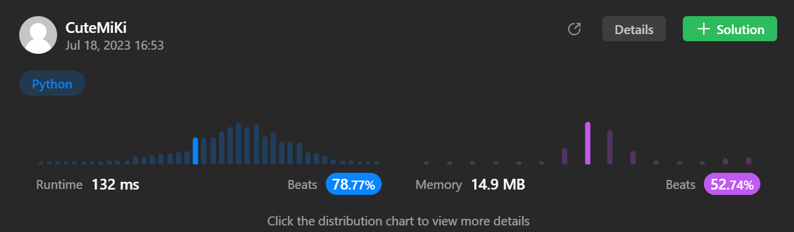

# 169. Majority Element
### Tag: [Easy](https://github.com/TheOnlyMiki/LeetCode-For-Fun/tree/main#easy-level), [Array](https://github.com/TheOnlyMiki/LeetCode-For-Fun/tree/main#array), [Hash Table](https://github.com/TheOnlyMiki/LeetCode-For-Fun/tree/main#hash-table), [Divide and Conquer](https://github.com/TheOnlyMiki/LeetCode-For-Fun/tree/main#divide-and-conquer), [Sorting](https://github.com/TheOnlyMiki/LeetCode-For-Fun/tree/main#sorting), [Counting](https://github.com/TheOnlyMiki/LeetCode-For-Fun/tree/main#counting)
---
<div class="px-5 pt-4"><div class="flex"></div><div class="_1l1MA" data-track-load="description_content"><p>Given an array <code>nums</code> of size <code>n</code>, return <em>the majority element</em>.</p>

<p>The majority element is the element that appears more than <code>⌊n / 2⌋</code> times. You may assume that the majority element always exists in the array.</p>

<p>&nbsp;</p>
<p><strong class="example">Example 1:</strong></p>
<pre><strong>Input:</strong> nums = [3,2,3]
<strong>Output:</strong> 3
</pre><p><strong class="example">Example 2:</strong></p>
<pre><strong>Input:</strong> nums = [2,2,1,1,1,2,2]
<strong>Output:</strong> 2
</pre>
<p>&nbsp;</p>
<p><strong>Constraints:</strong></p>

<ul>
	<li><code>n == nums.length</code></li>
	<li><code>1 &lt;= n &lt;= 5 * 10<sup>4</sup></code></li>
	<li><code>-10<sup>9</sup> &lt;= nums[i] &lt;= 10<sup>9</sup></code></li>
</ul>

<p>&nbsp;</p>
<strong>Follow-up:</strong> Could you solve the problem in linear time and in <code>O(1)</code> space?</div></div>

---


### Solution

```python
class Solution(object):
    def majorityElement(self, nums):
        """
        :type nums: List[int]
        :rtype: int
        """
        #Option 3
        nums.sort()
        return nums[int(len(nums)/2)]

        #Option 2
        """
        count = {}
        
        for value in nums:
            if value in count:
                count[value] += 1
            else:
                count[value] = 1
        
        return max(count, key=count.get)
        """

        #Option 1
        """
        count = {}
        n = len(nums)
        majority = int((n+1)/2)
        
        for i in range(majority):
            if nums[i] in count:
                count[nums[i]] += 1
            else:
                count[nums[i]] = 1

        if majority not in count.values():
            for i in range(majority, n):
                if nums[i] in count:
                    count[nums[i]] += 1
                else:
                    count[nums[i]] = 1
        
        return max(count, key=count.get)"""
```
