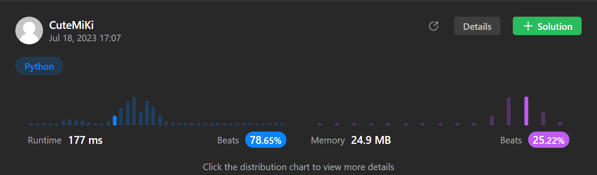

# 189. Rotate Array
### Tag: [Medium](https://github.com/TheOnlyMiki/LeetCode-For-Fun/tree/main#medium-level), [Array](https://github.com/TheOnlyMiki/LeetCode-For-Fun/tree/main#array), [Math](https://github.com/TheOnlyMiki/LeetCode-For-Fun/tree/main#math), [Two Pointers](https://github.com/TheOnlyMiki/LeetCode-For-Fun/tree/main#two-pointers)
---
<div class="px-5 pt-4"><div class="flex"></div><div class="_1l1MA" data-track-load="description_content"><p>Given an integer array <code>nums</code>, rotate the array to the right by <code>k</code> steps, where <code>k</code> is non-negative.</p>

<p>&nbsp;</p>
<p><strong class="example">Example 1:</strong></p>

<pre><strong>Input:</strong> nums = [1,2,3,4,5,6,7], k = 3
<strong>Output:</strong> [5,6,7,1,2,3,4]
<strong>Explanation:</strong>
rotate 1 steps to the right: [7,1,2,3,4,5,6]
rotate 2 steps to the right: [6,7,1,2,3,4,5]
rotate 3 steps to the right: [5,6,7,1,2,3,4]
</pre>

<p><strong class="example">Example 2:</strong></p>

<pre><strong>Input:</strong> nums = [-1,-100,3,99], k = 2
<strong>Output:</strong> [3,99,-1,-100]
<strong>Explanation:</strong> 
rotate 1 steps to the right: [99,-1,-100,3]
rotate 2 steps to the right: [3,99,-1,-100]
</pre>

<p>&nbsp;</p>
<p><strong>Constraints:</strong></p>

<ul>
	<li><code>1 &lt;= nums.length &lt;= 10<sup>5</sup></code></li>
	<li><code>-2<sup>31</sup> &lt;= nums[i] &lt;= 2<sup>31</sup> - 1</code></li>
	<li><code>0 &lt;= k &lt;= 10<sup>5</sup></code></li>
</ul>

<p>&nbsp;</p>
<p><strong>Follow up:</strong></p>

<ul>
	<li>Try to come up with as many solutions as you can. There are at least <strong>three</strong> different ways to solve this problem.</li>
	<li>Could you do it in-place with <code>O(1)</code> extra space?</li>
</ul>
</div></div>

---


### Solution

```python
class Solution(object):
    def rotate(self, nums, k):
        """
        :type nums: List[int]
        :type k: int
        :rtype: None Do not return anything, modify nums in-place instead.
        """
	# Option 2 - Space O(1)
        k = k % len(nums)

        def swap(left, right):
            while left < right:
                nums[left], nums[right] = nums[right], nums[left]
                left, right = left + 1, right - 1

        swap(0, len(nums)-1-k)
        swap(len(nums)-k, len(nums)-1)
        swap(0, len(nums)-1)
        
        # Option 1 - Space O(n)
        """
        shift_position = len(nums) - (k % len(nums))

        #return nums[shift_position:] + nums[:shift_position]

        nums[:] = nums[shift_position:] + nums[:shift_position]
        """
```
