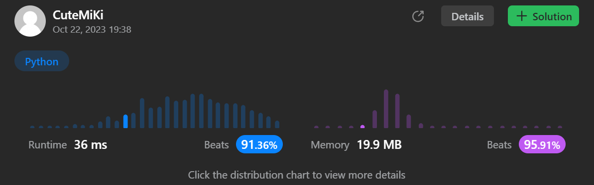

# 203. Remove Linked List Elements
### Tag: [Easy](https://github.com/TheOnlyMiki/LeetCode-For-Fun/tree/main#easy-level), [Linked List](https://github.com/TheOnlyMiki/LeetCode-For-Fun/tree/main#linked-list)
---
<div class="px-5 pt-4"><div class="flex"></div><div class="xFUwe" data-track-load="description_content"><p>Given the <code>head</code> of a linked list and an integer <code>val</code>, remove all the nodes of the linked list that has <code>Node.val == val</code>, and return <em>the new head</em>.</p>

<p>&nbsp;</p>
<p><strong class="example">Example 1:</strong></p>

<pre><strong>Input:</strong> head = [1,2,6,3,4,5,6], val = 6
<strong>Output:</strong> [1,2,3,4,5]
</pre>

<p><strong class="example">Example 2:</strong></p>

<pre><strong>Input:</strong> head = [], val = 1
<strong>Output:</strong> []
</pre>

<p><strong class="example">Example 3:</strong></p>

<pre><strong>Input:</strong> head = [7,7,7,7], val = 7
<strong>Output:</strong> []
</pre>

<p>&nbsp;</p>
<p><strong>Constraints:</strong></p>

<ul>
	<li>The number of nodes in the list is in the range <code>[0, 10<sup>4</sup>]</code>.</li>
	<li><code>1 &lt;= Node.val &lt;= 50</code></li>
	<li><code>0 &lt;= val &lt;= 50</code></li>
</ul>
</div></div>

---


### Solution

```python
# Definition for singly-linked list.
# class ListNode(object):
#     def __init__(self, val=0, next=None):
#         self.val = val
#         self.next = next
class Solution(object):
    def removeElements(self, head, val):
        """
        :type head: ListNode
        :type val: int
        :rtype: ListNode
        """
        return_head = previou = ListNode(next=head)
        while head:
            if head.val == val:
                previou.next = head.next
            else:
                previou = head
            head = head.next

        return return_head.next
```
