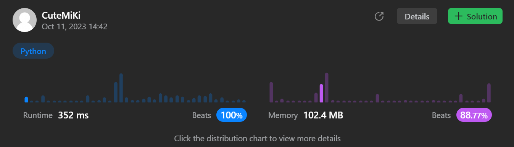

# 204. Count Primes
### Tag: [Medium](https://github.com/TheOnlyMiki/LeetCode-For-Fun/tree/main#medium-level), [Array](https://github.com/TheOnlyMiki/LeetCode-For-Fun/tree/main#array), [Math](https://github.com/TheOnlyMiki/LeetCode-For-Fun/tree/main#math)
---
<div class="px-5 pt-4"><div class="flex"></div><div class="xFUwe" data-track-load="description_content"><p>Given an integer <code>n</code>, return <em>the number of prime numbers that are strictly less than</em> <code>n</code>.</p>

<p>&nbsp;</p>
<p><strong class="example">Example 1:</strong></p>

<pre><strong>Input:</strong> n = 10
<strong>Output:</strong> 4
<strong>Explanation:</strong> There are 4 prime numbers less than 10, they are 2, 3, 5, 7.
</pre>

<p><strong class="example">Example 2:</strong></p>

<pre><strong>Input:</strong> n = 0
<strong>Output:</strong> 0
</pre>

<p><strong class="example">Example 3:</strong></p>

<pre><strong>Input:</strong> n = 1
<strong>Output:</strong> 0
</pre>

<p>&nbsp;</p>
<p><strong>Constraints:</strong></p>

<ul>
	<li><code>0 &lt;= n &lt;= 5 * 10<sup>6</sup></code></li>
</ul>
</div></div>

---


### Solution

```python
class Solution(object):
    def countPrimes(self, n):
        """
        :type n: int
        :rtype: int
        """
        # Option 2 - BF with Math
        record = [1] * n
        record[4 : n : 2] = [0] * ((n - 1 - 4) // 2 + 1)

        last_index, num, num_pow_2 = n-1, 3, 9
        while num_pow_2 < n:
            if record[num]:
                record[num_pow_2 : n : num] = [0] * ((last_index - num_pow_2) // num + 1)

            num, num_pow_2 = num+2, (num+2)**2

        return sum(record) - 2 if n > 2 else 0

        # Option 1 - BF
        """
        record = [1] * n
        for num in range(2, n):
            if record[num]:
                record[num*num : n : num] = [0] * len(record[num*num : n : num])

        return sum(record) - 2 if n > 2 else 0
        """
```
