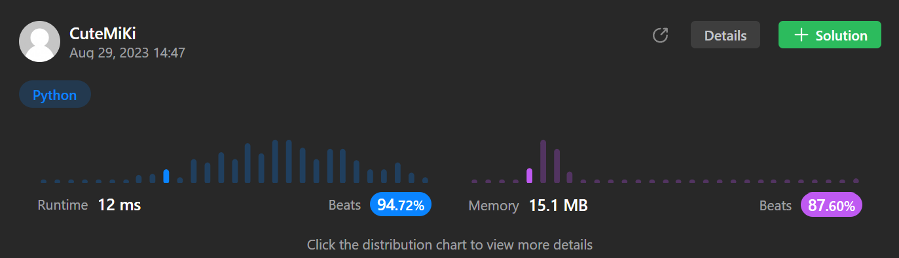

# 206. Reverse Linked List
### Tag: [Easy](https://github.com/TheOnlyMiki/LeetCode-For-Fun/tree/main#easy-level), [Linked List](https://github.com/TheOnlyMiki/LeetCode-For-Fun/tree/main#linked-list)
---
<div class="px-5 pt-4"><div class="flex"></div><div class="xFUwe" data-track-load="description_content"><p>Given the <code>head</code> of a singly linked list, reverse the list, and return <em>the reversed list</em>.</p>

<p>&nbsp;</p>
<p><strong class="example">Example 1:</strong></p>

<pre><strong>Input:</strong> head = [1,2,3,4,5]
<strong>Output:</strong> [5,4,3,2,1]
</pre>

<p><strong class="example">Example 2:</strong></p>

<pre><strong>Input:</strong> head = [1,2]
<strong>Output:</strong> [2,1]
</pre>

<p><strong class="example">Example 3:</strong></p>

<pre><strong>Input:</strong> head = []
<strong>Output:</strong> []
</pre>

<p>&nbsp;</p>
<p><strong>Constraints:</strong></p>

<ul>
	<li>The number of nodes in the list is the range <code>[0, 5000]</code>.</li>
	<li><code>-5000 &lt;= Node.val &lt;= 5000</code></li>
</ul>

<p>&nbsp;</p>
<p><strong>Follow up:</strong> A linked list can be reversed either iteratively or recursively. Could you implement both?</p>
</div></div>

---


### Solution

```python
# Definition for singly-linked list.
# class ListNode(object):
#     def __init__(self, val=0, next=None):
#         self.val = val
#         self.next = next
class Solution(object):
    def reverseList(self, head):
        """
        :type head: ListNode
        :rtype: ListNode
        """
        # Option 2 - Iteration
        previou = temp = None
        current = head
        
        while current:
            temp = current.next
            current.next = previou
            previou = current
            current = temp

        return previou

        # Option 1 - recursively
        """
        def reverseNode(previou, current):
            if current.next:
                temp = current.next
                current.next = previou
                return reverseNode(current, temp)
            else:
                current.next = previou
                return current

        return reverseNode(None, head) if head else None
        """
```
