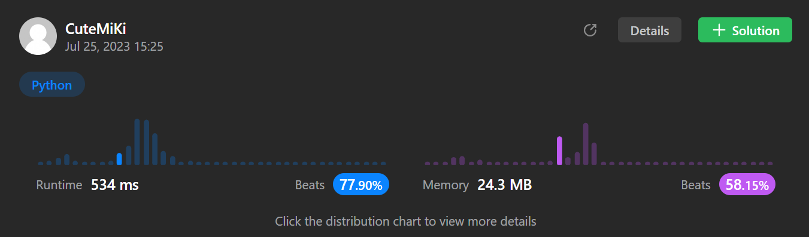

# 219. Contains Duplicate II
### Tag: [Easy](https://github.com/TheOnlyMiki/LeetCode-For-Fun/tree/main#easy-level), [Array](https://github.com/TheOnlyMiki/LeetCode-For-Fun/tree/main#array), [Hash Table](https://github.com/TheOnlyMiki/LeetCode-For-Fun/tree/main#hash-table), [Sliding Window](https://github.com/TheOnlyMiki/LeetCode-For-Fun/tree/main#sliding-window)
---
<div class="px-5 pt-4"><div class="flex"></div><div class="_1l1MA" data-track-load="description_content"><p>Given an integer array <code>nums</code> and an integer <code>k</code>, return <code>true</code> <em>if there are two <strong>distinct indices</strong> </em><code>i</code><em> and </em><code>j</code><em> in the array such that </em><code>nums[i] == nums[j]</code><em> and </em><code>abs(i - j) &lt;= k</code>.</p>

<p>&nbsp;</p>
<p><strong class="example">Example 1:</strong></p>

<pre><strong>Input:</strong> nums = [1,2,3,1], k = 3
<strong>Output:</strong> true
</pre>

<p><strong class="example">Example 2:</strong></p>

<pre><strong>Input:</strong> nums = [1,0,1,1], k = 1
<strong>Output:</strong> true
</pre>

<p><strong class="example">Example 3:</strong></p>

<pre><strong>Input:</strong> nums = [1,2,3,1,2,3], k = 2
<strong>Output:</strong> false
</pre>

<p>&nbsp;</p>
<p><strong>Constraints:</strong></p>

<ul>
	<li><code>1 &lt;= nums.length &lt;= 10<sup>5</sup></code></li>
	<li><code>-10<sup>9</sup> &lt;= nums[i] &lt;= 10<sup>9</sup></code></li>
	<li><code>0 &lt;= k &lt;= 10<sup>5</sup></code></li>
</ul>
</div></div>

---


### Solution

```python
class Solution(object):
    def containsNearbyDuplicate(self, nums, k):
        """
        :type nums: List[int]
        :type k: int
        :rtype: bool
        """
        count = {}
        for i, num in enumerate(nums):
            if num in count and i - count[num] <= k:
                    return True
            count[num] = i

        return False
```
