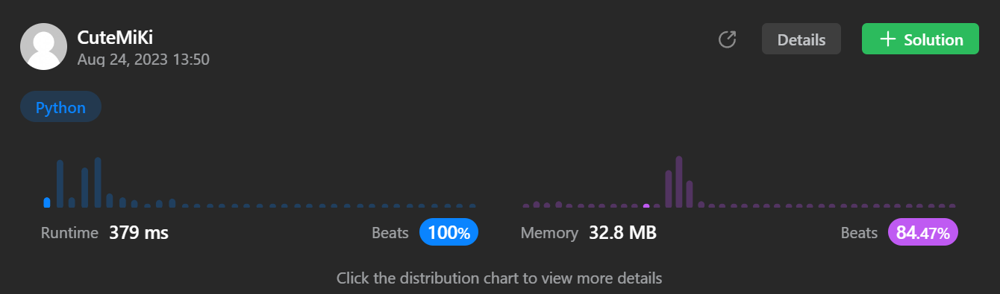

# 221. Maximal Square
### Tag: [Medium](https://github.com/TheOnlyMiki/LeetCode-For-Fun/tree/main#medium-level), [Array](https://github.com/TheOnlyMiki/LeetCode-For-Fun/tree/main#array), [Dynamic Programming](https://github.com/TheOnlyMiki/LeetCode-For-Fun/tree/main#dynamic-programming), [Matrix](https://github.com/TheOnlyMiki/LeetCode-For-Fun/tree/main#matrix)
---
<div class="px-5 pt-4"><div class="flex"></div><div class="xFUwe" data-track-load="description_content"><p>Given an <code>m x n</code> binary <code>matrix</code> filled with <code>0</code>'s and <code>1</code>'s, <em>find the largest square containing only</em> <code>1</code>'s <em>and return its area</em>.</p>

<p>&nbsp;</p>
<p><strong class="example">Example 1:</strong></p>

<pre><strong>Input:</strong> matrix = [["1","0","1","0","0"],["1","0","1","1","1"],["1","1","1","1","1"],["1","0","0","1","0"]]
<strong>Output:</strong> 4
</pre>

<p><strong class="example">Example 2:</strong></p>

<pre><strong>Input:</strong> matrix = [["0","1"],["1","0"]]
<strong>Output:</strong> 1
</pre>

<p><strong class="example">Example 3:</strong></p>

<pre><strong>Input:</strong> matrix = [["0"]]
<strong>Output:</strong> 0
</pre>

<p>&nbsp;</p>
<p><strong>Constraints:</strong></p>

<ul>
	<li><code>m == matrix.length</code></li>
	<li><code>n == matrix[i].length</code></li>
	<li><code>1 &lt;= m, n &lt;= 300</code></li>
	<li><code>matrix[i][j]</code> is <code>'0'</code> or <code>'1'</code>.</li>
</ul>
</div></div>

---


### Solution

```python
class Solution(object):
    def maximalSquare(self, matrix):
        """
        :type matrix: List[List[str]]
        :rtype: int
        """
        # Option 2 - Dynamic Program, Space O(n)
        length2 = len(matrix[0])+1
        cols = range(1, length2)

        record1 = [0]*length2
        record2 = None

        output = 0
        previou_i = None
        for i in range(1, len(matrix)+1):
            record2 = [0]*length2
            previou_i = i-1
            for j in cols:
                if matrix[previou_i][j-1] == '1':
                    record2[j] = min(record1[j], record2[j-1], record1[j-1]) + 1
                if output < record2[j]:
                    output = record2[j]

            record1 = record2
        
        return output**2

        # Option 1 - Dynamic Program, Space O(m*n)
        """
        length2 = len(matrix[0])+1
        cols = range(1, length2)

        record = [[0]*length2 for _ in matrix]
        record.append([0]*length2)

        output = 0

        previou_i = None
        for i in range(1, len(record)):
            previou_i = i-1
            for j in cols:
                if matrix[previou_i][j-1] == '1':
                    record[i][j] = min(record[previou_i][j], record[i][j-1], record[previou_i][j-1]) + 1
                if output < record[i][j]:
                    output = record[i][j]
        
        return output**2
        """
```
