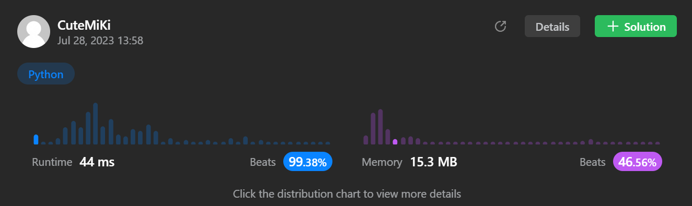

# 224. Basic Calculator
### Tag: [Hard](https://github.com/TheOnlyMiki/LeetCode-For-Fun/tree/main#hard-level), [Math](https://github.com/TheOnlyMiki/LeetCode-For-Fun/tree/main#math), [String](https://github.com/TheOnlyMiki/LeetCode-For-Fun/tree/main#string), [Stack](https://github.com/TheOnlyMiki/LeetCode-For-Fun/tree/main#stack)
---
<div class="px-5 pt-4"><div class="flex"></div><div class="_1l1MA" data-track-load="description_content"><p>Given a string <code>s</code> representing a valid expression, implement a basic calculator to evaluate it, and return <em>the result of the evaluation</em>.</p>

<p><strong>Note:</strong> You are <strong>not</strong> allowed to use any built-in function which evaluates strings as mathematical expressions, such as <code>eval()</code>.</p>

<p>&nbsp;</p>
<p><strong class="example">Example 1:</strong></p>

<pre><strong>Input:</strong> s = "1 + 1"
<strong>Output:</strong> 2
</pre>

<p><strong class="example">Example 2:</strong></p>

<pre><strong>Input:</strong> s = " 2-1 + 2 "
<strong>Output:</strong> 3
</pre>

<p><strong class="example">Example 3:</strong></p>

<pre><strong>Input:</strong> s = "(1+(4+5+2)-3)+(6+8)"
<strong>Output:</strong> 23
</pre>

<p>&nbsp;</p>
<p><strong>Constraints:</strong></p>

<ul>
	<li><code>1 &lt;= s.length &lt;= 3 * 10<sup>5</sup></code></li>
	<li><code>s</code> consists of digits, <code>'+'</code>, <code>'-'</code>, <code>'('</code>, <code>')'</code>, and <code>' '</code>.</li>
	<li><code>s</code> represents a valid expression.</li>
	<li><code>'+'</code> is <strong>not</strong> used as a unary operation (i.e., <code>"+1"</code> and <code>"+(2 + 3)"</code> is invalid).</li>
	<li><code>'-'</code> could be used as a unary operation (i.e., <code>"-1"</code> and <code>"-(2 + 3)"</code> is valid).</li>
	<li>There will be no two consecutive operators in the input.</li>
	<li>Every number and running calculation will fit in a signed 32-bit integer.</li>
</ul>
</div></div>

---


### Solution

```python
class Solution(object):
    def calculate(self, s):
        """
        :type s: str
        :rtype: int
        """
        # Option 2
        ascii_0 = ord('0')
        direction = 1
        stack = [1]
        consum = 0
        digits = 0

        for i in s:
            if i.isdigit():
                digits = digits * 10 + ord(i) - ascii_0
            elif i == '(':
                stack.append(direction)
            elif i == ')':
                stack.pop()
            elif i != ' ':
                consum += direction * digits
                direction = (-1 if i == '-' else 1) * stack[-1]
                digits = 0

        return consum + direction * digits

        # Option 1 - Poor solution
        """
        stack = ['(']
        temp_num = ""
        num = num_2 = None

        for item in s + ')':
            # Handle dights 1234567890
            if item.isdigit():
                temp_num += item
            # Handle '('
            elif item == '(':
                stack.append(item)
            # Handle '+' '-' ')'
            elif item != ' ':
                # If the previou number exist, then push into stack
                if temp_num:
                    stack.append(temp_num)
                
                temp_num = ""
                
                # Handle ')'
                if item == ')':
                    num = num_2 = 0
                    last = None
                    
                    while stack[-1] != '(':
                        if stack[-1] == '+':
                            num_2 += num
                        elif stack[-1] == '-':
                            num_2 -= num
                        else:
                            num = int(stack[-1])
                        last = stack[-1]
                        stack.pop()
                    
                    stack.pop()
                    if last == '-' or last == '+':
                        stack.append(str(num_2))
                    else:
                        stack.append(str(num_2 + num))
                # Handle '+' or '-'
                else:
                    stack.append(item)

        return int(stack[0])
        """
```
