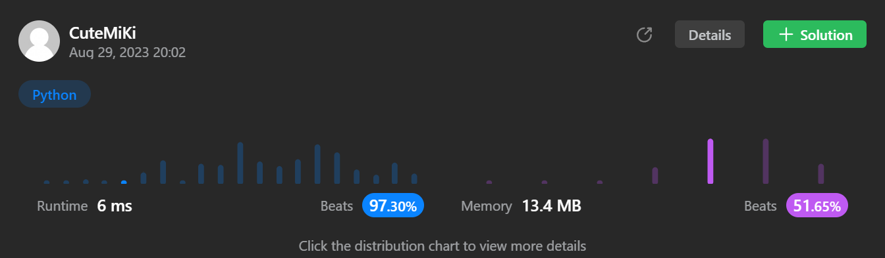

# 225. Implement Stack using Queues
### Tag: [Easy](https://github.com/TheOnlyMiki/LeetCode-For-Fun/tree/main#easy-level), [Design](https://github.com/TheOnlyMiki/LeetCode-For-Fun/tree/main#design), [Stack](https://github.com/TheOnlyMiki/LeetCode-For-Fun/tree/main#stack), [Queue](https://github.com/TheOnlyMiki/LeetCode-For-Fun/tree/main#queue)
---
<div class="px-5 pt-4"><div class="flex"></div><div class="xFUwe" data-track-load="description_content"><p>Implement a last-in-first-out (LIFO) stack using only two queues. The implemented stack should support all the functions of a normal stack (<code>push</code>, <code>top</code>, <code>pop</code>, and <code>empty</code>).</p>

<p>Implement the <code>MyStack</code> class:</p>

<ul>
	<li><code>void push(int x)</code> Pushes element x to the top of the stack.</li>
	<li><code>int pop()</code> Removes the element on the top of the stack and returns it.</li>
	<li><code>int top()</code> Returns the element on the top of the stack.</li>
	<li><code>boolean empty()</code> Returns <code>true</code> if the stack is empty, <code>false</code> otherwise.</li>
</ul>

<p><b>Notes:</b></p>

<ul>
	<li>You must use <strong>only</strong> standard operations of a queue, which means that only <code>push to back</code>, <code>peek/pop from front</code>, <code>size</code> and <code>is empty</code> operations are valid.</li>
	<li>Depending on your language, the queue may not be supported natively. You may simulate a queue using a list or deque (double-ended queue) as long as you use only a queue's standard operations.</li>
</ul>

<p>&nbsp;</p>
<p><strong class="example">Example 1:</strong></p>

<pre><strong>Input</strong>
["MyStack", "push", "push", "top", "pop", "empty"]
[[], [1], [2], [], [], []]
<strong>Output</strong>
[null, null, null, 2, 2, false]

<strong>Explanation</strong>
MyStack myStack = new MyStack();
myStack.push(1);
myStack.push(2);
myStack.top(); // return 2
myStack.pop(); // return 2
myStack.empty(); // return False
</pre>

<p>&nbsp;</p>
<p><strong>Constraints:</strong></p>

<ul>
	<li><code>1 &lt;= x &lt;= 9</code></li>
	<li>At most <code>100</code> calls will be made to <code>push</code>, <code>pop</code>, <code>top</code>, and <code>empty</code>.</li>
	<li>All the calls to <code>pop</code> and <code>top</code> are valid.</li>
</ul>

<p>&nbsp;</p>
<p><strong>Follow-up:</strong> Can you implement the stack using only one queue?</p>
</div></div>

---


### Solution

```python
from collections import deque
class MyStack(object):

    def __init__(self):
        self.queue = deque()

    def push(self, x):
        """
        :type x: int
        :rtype: None
        """
        self.queue.append(x)

    def pop(self):
        """
        :rtype: int
        """

        for _ in range(len(self.queue)-1):
            self.queue.append(self.queue.popleft())

        return self.queue.popleft()

    def top(self):
        """
        :rtype: int
        """
        return self.queue[-1]

    def empty(self):
        """
        :rtype: bool
        """
        return True if len(self.queue) == 0 else False


# Your MyStack object will be instantiated and called as such:
# obj = MyStack()
# obj.push(x)
# param_2 = obj.pop()
# param_3 = obj.top()
# param_4 = obj.empty()
```
