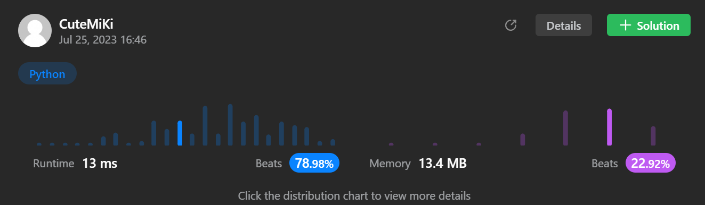

# 228. Summary Ranges
### Tag: [Easy](https://github.com/TheOnlyMiki/LeetCode-For-Fun/tree/main#easy-level), [Array](https://github.com/TheOnlyMiki/LeetCode-For-Fun/tree/main#array)
---
<div class="px-5 pt-4"><div class="flex"></div><div class="_1l1MA" data-track-load="description_content"><p>You are given a <strong>sorted unique</strong> integer array <code>nums</code>.</p>

<p>A <strong>range</strong> <code>[a,b]</code> is the set of all integers from <code>a</code> to <code>b</code> (inclusive).</p>

<p>Return <em>the <strong>smallest sorted</strong> list of ranges that <strong>cover all the numbers in the array exactly</strong></em>. That is, each element of <code>nums</code> is covered by exactly one of the ranges, and there is no integer <code>x</code> such that <code>x</code> is in one of the ranges but not in <code>nums</code>.</p>

<p>Each range <code>[a,b]</code> in the list should be output as:</p>

<ul>
	<li><code>"a-&gt;b"</code> if <code>a != b</code></li>
	<li><code>"a"</code> if <code>a == b</code></li>
</ul>

<p>&nbsp;</p>
<p><strong class="example">Example 1:</strong></p>

<pre><strong>Input:</strong> nums = [0,1,2,4,5,7]
<strong>Output:</strong> ["0-&gt;2","4-&gt;5","7"]
<strong>Explanation:</strong> The ranges are:
[0,2] --&gt; "0-&gt;2"
[4,5] --&gt; "4-&gt;5"
[7,7] --&gt; "7"
</pre>

<p><strong class="example">Example 2:</strong></p>

<pre><strong>Input:</strong> nums = [0,2,3,4,6,8,9]
<strong>Output:</strong> ["0","2-&gt;4","6","8-&gt;9"]
<strong>Explanation:</strong> The ranges are:
[0,0] --&gt; "0"
[2,4] --&gt; "2-&gt;4"
[6,6] --&gt; "6"
[8,9] --&gt; "8-&gt;9"
</pre>

<p>&nbsp;</p>
<p><strong>Constraints:</strong></p>

<ul>
	<li><code>0 &lt;= nums.length &lt;= 20</code></li>
	<li><code>-2<sup>31</sup> &lt;= nums[i] &lt;= 2<sup>31</sup> - 1</code></li>
	<li>All the values of <code>nums</code> are <strong>unique</strong>.</li>
	<li><code>nums</code> is sorted in ascending order.</li>
</ul>
</div></div>

---


### Solution

```python
class Solution(object):
    def summaryRanges(self, nums):
        """
        :type nums: List[int]
        :rtype: List[str]
        """
        # Option 2
        output = []
        nums_len = len(nums)
        i = 0

        while i < nums_len:
            num = nums[i]

            while i + 1 < nums_len and nums[i] + 1 == nums[i+1]:
                i += 1

            if nums[i] == num:
                output.append(str(num))
            else:
                output.append(str(num)+"->"+str(nums[i]))

            i += 1

        return output

        # Option 1
        """
        if len(nums) == 0:
            return []

        output = []
        start = nums[0]
        end = start

        for num in nums[1:]:
            if num != end + 1:
                if start == end:
                    output.append(str(start))
                else:
                    output.append(str(start)+"->"+str(end))
                start = end = num

            end = num

        # Handle the remain
        if start == end:
            output.append(str(start))
        else:
            output.append(str(start)+"->"+str(end))

        return output
        """
```
